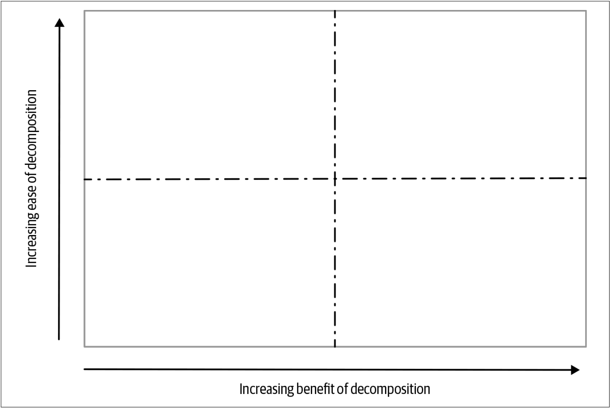
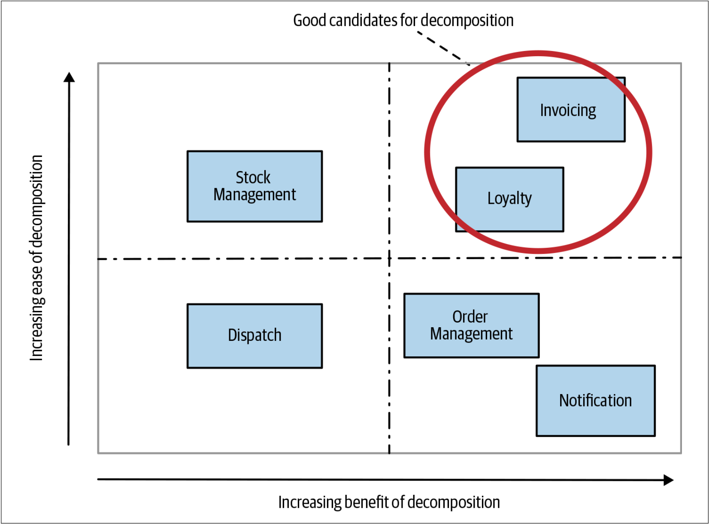

# 融合模型

我们希望获得一些快速的成功，以实现如下的目标：
* 尽早取得进展
* 建立某种气势
* 早日获得方法有效性的反馈。

这将迫使我们选择更容易抽取的功能。 但是，我们还需要从拆解中获得收益——我们如何将其纳入我们的思考范围？

从根本上讲，这两种形式的优先级都是有意义的，但是我们需要一种机制来将两者统一起来并做适当的权衡折衷。我喜欢使用图2-7所示的简单结构来解决这个问题。沿着图中所示的两个坐标轴来放置每个要抽取的候选服务。x轴表示拆解服务将带来的价值，y轴表示拆解服务的难易程度。

图2-7. 确定服务拆分优先级的简单模型

像一个团队一样协作完成此图2-7所示的优先级确定的过程，我们可以确定最佳抽取对象。如图2-8所示，和所有的好的四象限模型一样，最佳抽取对象是我们所喜欢的右上角象限的功能。右上角象限中的功能（包括Invoicing）代表了我们认为应该易于提取、并且还将带来收益的功能。 因此，从该象限的功能组中择一个（或两个）服务作为要抽取的第一个服务。

图2-8. 使用优先级四象限确定优先级的例子 

一旦开始开始进行变更，我们会学到更多。我们认为容易的事情会变得很难。我们认为困难的事情会变得容易。这中情况非常自然！但这确实意味着如下的事情非常重要：重新了解如上的确定优先级的工作，并在我们了解了更多信息后重新规划优先级。也许随着我们的不断学习，我们会意识到Notifications功能可能比想象中的要容易抽取。
