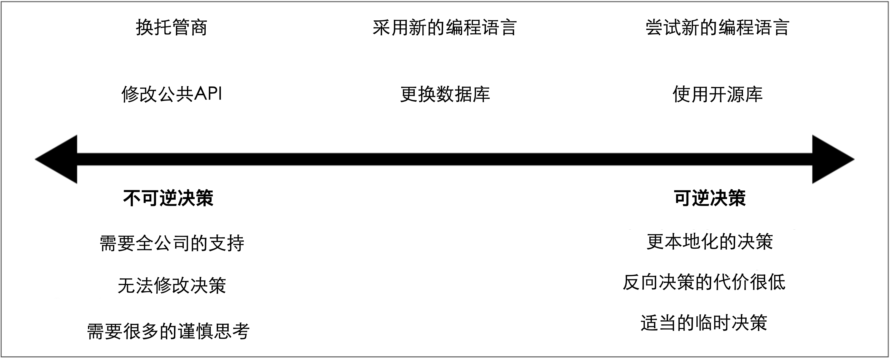

# 变革的成本
在本书中，我提到了从小处着手、增量变更的很多原因，但是最主要的原因之一是：我们要了解每一次变更的影响，并在必要的时候修改变更的方案。增量变更可以更好地降低犯错的代价，但是却并不能完全避免犯错。在变更过程中犯错不可避免，我们应该拥抱变更过程中所犯的错误。我们还应该了解如何才能更好的降低错误的代价。

## 可逆决策和不可逆决策
亚马逊首席执行官Jeff Bezos在2015年度的致股东信中提出了对亚马逊工作方式的有趣见解。信中包含如下的精华部分：

> 有些决策像一扇单向门，是至关重要的、不可逆的或几乎不可逆的。因此，这些决策必须经过深思熟虑与磋商，然后有条不紊地、谨慎地、缓慢地推进。如果我们穿过这扇门，但是却不喜欢在另一边看到的东西，我们也没有办法再回到从前。我们称其为**1型决策**。然而大多数决策却并非如此：它们像一扇双向门，是可变的、可逆的。如果我们做了一个次优的**2型决策**，就没必要过度看重结果的好坏。我们可以重新打开这扇门，然后再回到从前。拥有决策权的高管或者小组织有权而且理所应当地快速做出**2型决策**。
> 
——Jeff Bezos, 致亚马逊股东的信（2015）

Bezos继续说，那些不经常做决定的人可能会陷入一个陷阱：像对待**1型决策**一样对待**2型决策**。这导致一切都变成生与死的问题，所有事情都变成了一项重大任务。问题在于：采用微服务架构会带来很多有关如何做的选择，这意味着需要比以前做更多的决策。如果不习惯这一点，我们可能会发现自己陷入了这个陷阱，同时进度也将陷入停顿。

这些术语并非惟妙惟俏，并且也很难记住**1型**或**2型**的实际含义，因此我更喜欢用不可逆和可逆来代替**1型**和**2型**。[^8]

尽管我喜欢这个概念，但我认为决策并非总是这二者中的其中之一，我认为需要更细粒度的决策类型。我宁愿将不可逆决策和可逆决策视为位于决策频谱的两端，如[图2-3](#f23)所示。

图2-3. 可逆决策和不可逆决策的差异及其例子

起初，评估我们在决策频谱上的位置可能具有挑战性，但是从根本上讲，如果我们后续决定改变主意的话，那么一切都将回到对影响面的理解。决策越接近不可逆决策，后续改变决策方向产生的影响就越大。

实际情况是，作为微服务迁移的一部分，我们做出的大量决策都将朝着可逆决策的方向发展。软件可能会经常发生回滚或撤消，我们可以回滚软件的变更或回滚软件的部署。我们需要做的是：考虑后续改变主意的成本。

不可逆的决策需要更多的投入、更谨慎的思考，我们应该（确实需要）花更多的时间去决策。我们越靠近决策频谱的右端——朝着可逆决策的方向——就越可以依赖接近问题的同事做出正确的决策。我们知道，即便他们做出了错误的决策，后续修复该错误也很容易。

## 从更简单的地方开始试验
在代码库中移动代码所涉及的成本非常小。很多工具可以支持我们这么做，并且如果在移动过程中产生错误，也可以很快解决这些错误。但是，拆分数据库的工作量却很大，同时，回滚数据库变更也同样复杂。类似的，拆解过度耦合的服务，或必须完全重写多个消费者使用的API也是一项艰巨的任务。巨大的变更成本意味着这些操作会增加风险。我们如何管理这种风险？我的方法是：在影响最小的地方试错。

我倾向于在变更成本和犯错成本都尽可能低的地方做很多思考：可以采用白板：

* 在白板上勾勒出我们的设计
* 观察在跨服务边界时运行用例会发生什么，以我们的唱片店为例：
  
  * 想象当客户搜索唱片、在网站上注册或购买专辑时会发生什么？
  * 调用了什么？
  * 是否看到了奇怪的循环引用？
  * 是否看到两个服务之间的调用过于频繁（可能表明应将它们合二为一）？

---
[^8]: Hat tip to Martin Fowler for the names here!