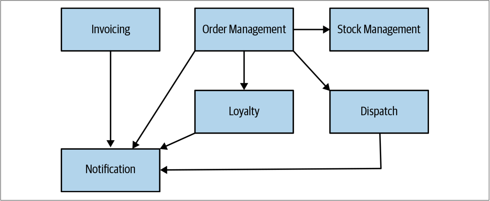
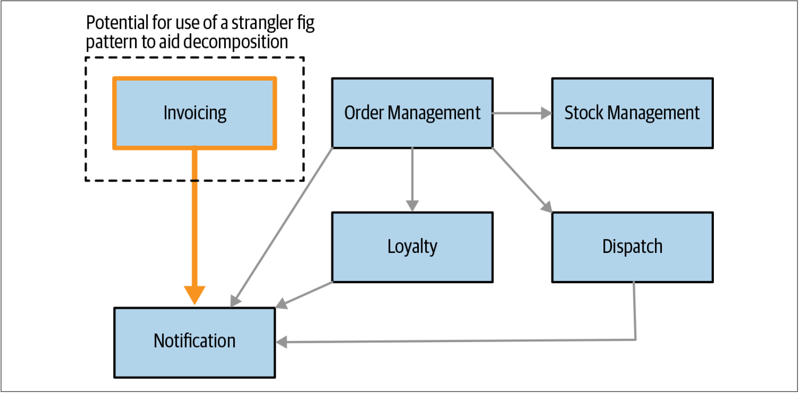

# 领域驱动设计

在第一章中，我介绍了[领域驱动设计（*DDD*）](Just_Enough_Domain_Driven_Design.md)。DDD是帮助定义服务边界的重要概念。开发领域模型有助于确定如何安排拆分工作的优先级。在图2-4中，我们为Music Corp提供了一个示例性的高层次（*high-level*）领域模型[^译注1]。从图2-4可以看到：作为领域建模结果的一组有界上下文。我们可以清楚地看到这些有界上下文之间的关系，可以想象它们将代表组织内部的交互。

图2-4. Music Corp的有界上下文及其之间的关系

每一个有界上下文都代表一个拆分之后的潜在的服务单元。如前所述，有界上下文是定义微服务边界的一个很好的起点。既然如此，我们就有了待确定优先级的事项清单。我们也可以从有界上下文之间的关系形式获得有用的信息，这些信息可以帮助我们在抽取不同的功能时评估其相对难度。我们很快会再讨论这个想法。

我会考虑提出一个领域模型，这是构建微服务迁移的必不可少的步骤。 通常令人生畏的是：许多人没有构建这种模型的直接经验。他们还非常担心这会涉及多少工作。实际上，虽然经验可以极大地帮助构建这样的逻辑模型，但是即使付出少量的努力也可以获得一些真正有用的收益。

## 还要走多远
拆解现有系统往往令人望而却步。许多人可能会构建并继续构建系统，——十有八九——可能有更多的人在日常工作中使用这种方式。在确定范围的情况下，尝试提出整个系统的详细域模型可能会很艰巨。

在确定从何处开始拆解时，我们需要从领域模型中获取到足够的信息来做出合理的决策。认识到如上的这一点非常重要。我们对系统中最需要关注的部分可能已经有所了解。因此，为单体系统提出一个高层次功能分组的通用模型就足够了。然后，再从中选择那些我们想要深入研究的部分。如果仅关注系统的一部分，可能会忽略需要解决的较大的系统性问题——这种风险始终存在。但是，我也不会为此而困惑——我们无需一开始不犯错误，我们只需要利用足够的信息来做出明智的后续操作即可。我们可以（而且应该）在学习中不断完善自己的领域模型，并在推进过程中不断更新以反映新的功能。

## 事件风暴
由Alberto Brandolini创建的Event Storming是一项由技术和非技术的利益相关者共同定义领域模型的一项团队协作活动。事件风暴以自底向上的方式进行：

* 参与者首先定义领域事件（*Domain Events*），即系统中发生的事情
* 然后，将这些事件分组并聚合
* 然后将聚合后的事件分组为有界上下文

Event Storming并不意味着必须先构建一个事件驱动（*event-drivern*）的系统，了解这一点非常重要。相反，Event Storming重点在于了解系统中发生了哪些（逻辑）事件——像系统的利益相关者那样明确事件的事实。虽然领域事件可以映射为事件驱动系统的触发事件（触发事件是事件驱动系统的一部分），但是可以用不同的方式来表示领域事件。

Alberto用Event Storming的技术真正关注的是：集体定义模型的想法。 该活动的输出不仅仅是模型本身，还有大家对模型的共同理解。为了使该过程正常

更详细地探讨Event Storming已经超出了本书的讨论范围，但是Event Storming技术是我用过且非常喜欢的一种技术。如果想探索更多Event Storming的相关内容，可以阅读Alberto的[**Event Storming简介**](https://leanpub.com/introducing_eventstorming)（该书目前还在撰写中）。

## 使用领域模型确定优先级
可以从类似图2-4的图中获得一些有用的见解。根据上游或下游依赖的数量，可以推断出抽取不同功能的难易程度。例如，如果我们考虑抽取**Notification**，那么我们可以清楚地看到许多入站依赖（*inbound dependencies*）[^译注2]。如图2-5所示：系统的许多部分都需要使用Nofification。因此，如果要抽取新的Notification服务，则需要处理大量现有代码——将从本地调用现有的Notification改为其微服务调用。我们将在第3章中探讨有关此类变更的多种技术。

图2-5. 从领域模型看，Notification功能存在逻辑耦合，因此抽取难度较大

因此，Notification功能可能不是好的开始。另一方面，如图2-6所示，Invoicing功能很可能是更容易抽取的系统行为。Invoicing没有入站依赖，这对单体应用所必须进行的变更量将会减少。这种情况下，类似绞杀者的模式可能是有效的，因为我们可以轻松地在这些入站调用到达单体之前对其进行代理。我们将在下一章探讨绞杀者模式及其他的很多模式。

图2-6. 发票系统看起来更容易抽取

在评估抽取难度时，如上的关联关系是一种开始的好方法。但是我们必须理解：领域模型代表了现有系统的逻辑视图。不能保证系统的底层代码结构也是以领域模型的方式来组织。这意味着逻辑模型可以指导我们了解功能耦合的多少，但是我们可能仍然需要查看代码本身，以更好地评估功能之间的耦合。这样的领域模型不会显示哪些有界上下文会把数据存储在数据库中。我们可能会发现，Invoicing功能管理着大量的数据，这意味着我们需要考虑数据库拆分对其带来的影响。正如我们将在第4章中讨论的那样，我们可以并且应该将单体系统的数据存储区分开。但是我们不想在我们的前几个微服务中一道讨论数据库的拆分。

因此，我们能够通过领域模型这面镜子来观察哪些是容易的事情以及哪些是比较难的事情。区分事情的难以程度是有价值的行为——毕竟我们希望获得快速的胜利！但是，我们必须记住，我们只是把微服务视为实现特定目标的一种方法。实际上，我们可能会发现发票功能确实是一个简单的开始，但是如果我们的目标是帮助缩短上市时间，并且发票功能又几乎没有改变，那么首先抽取发票功能的方式并没有有效利用时间。

因此，我们需要将事情的难易程度与微服务拆分带来的好处相结合。

---
[^译注1]: 高层次设计（high-level design）是整个系统的设计——包括系统架构和数据库设计。它描述了该系统的各个模块和功能之间的关系。低级别设计（low-level design）定义了用于该系统的每个部件的实际逻辑。
[^译注2]: There are two main varieties of dependencies: outbound and inbound. Outbound means that the project relies on one activity being carried out by a particular team so as to proceed to another task or deliver results. Conversely, inbound means that other parties are relying on a particular team to finish a task before they deliver results. An example of an outbound dependency is when one has to wait for the legal department to review and approve a particular document before being allowed to make any adjustments to the system.