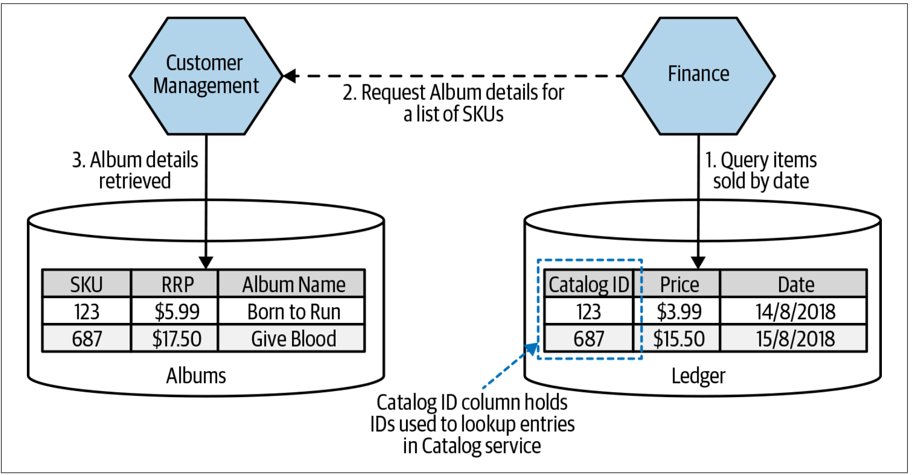
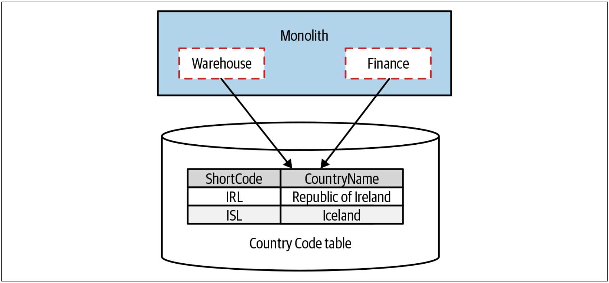
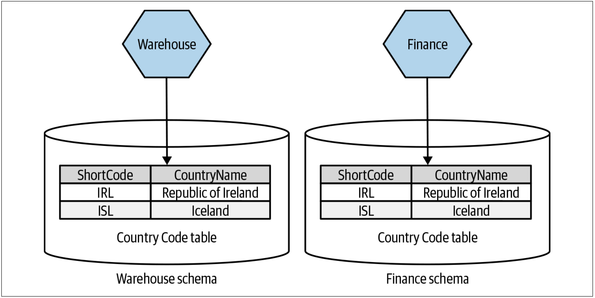
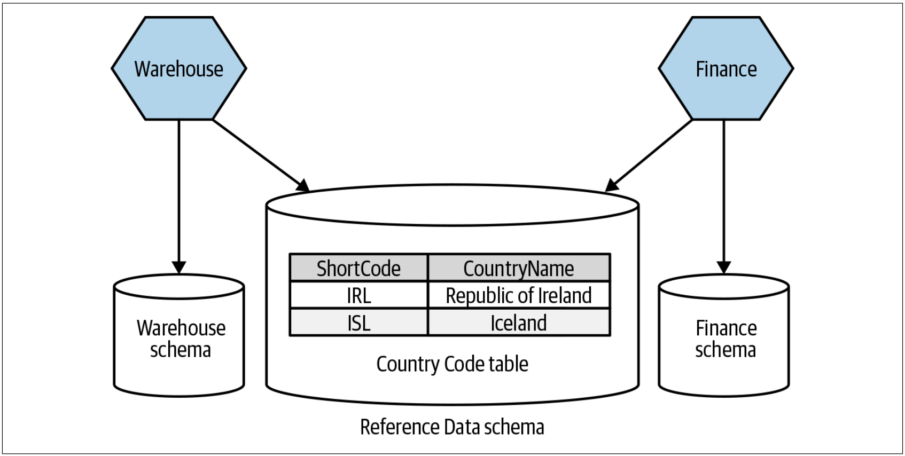
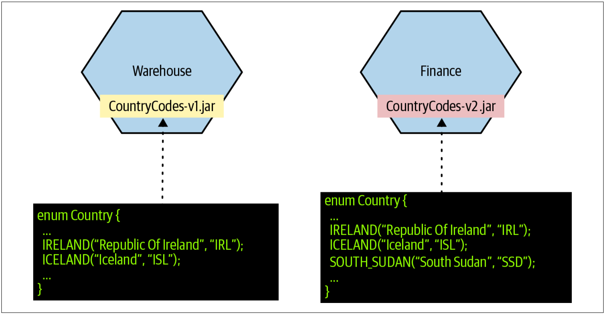
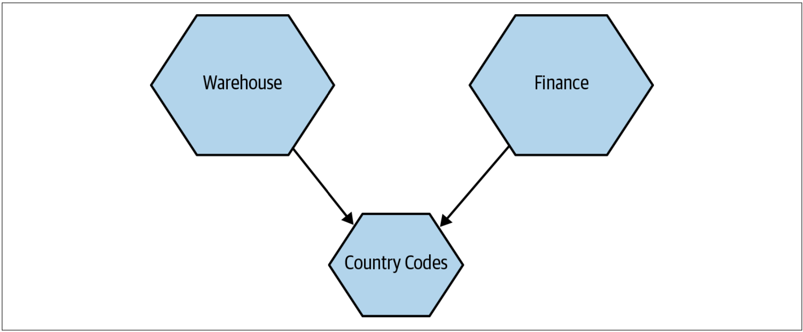
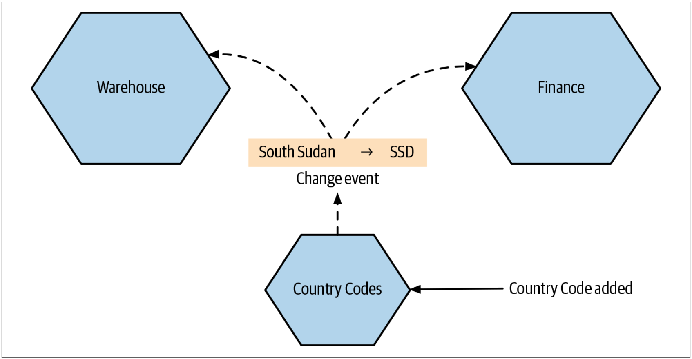

# 把表的外键关系移至代码

我们已决定抽取Catalog服务，该服务可以管理并开放有关*艺术家*，*曲目*和*专辑*的相关信息。当前，单体中与catalog相关的代码会使用`Albums`表来存储有关我们可以发售的CD的信息。最终，`Ledger`表会引用这些专辑并跟踪专辑的销售信息，如[图4-37](#f437)所示。`Ledger`表中的每一行仅记录了每张CD的销售额以及所售商品的`ID`。在该例中，我们把`ID`称为`SKU`（*a stock keeping unit*），这是零售系统中的常见做法。

图4-37. 外键关系

每个月底，我们需要产出一份报告来概述我们最畅销的CD。`Ledger`表可帮助我们来了解哪个`SKU`的销售量最大，但是有关该`SKU`的信息却在`Albums`表。我们希望使报告易于阅读，因此，与其说“我们卖出了400张`SKU 123`并获得$1,596的销售额”，不如说“我们卖出了400张Bruce Springsteen的Born to Run，并获得$1,596的销售额”。为此，财务相关代码所触发的数据库查询需要**连接**`Ledger`表和`Albums`表的信息，如[图4-37](#f437)所示。

我们在schema中定义了外键，因此我们标识`Ledger`表中的行和`Albums`表中的行存在关系。通过定义这样的关系，底层数据库引擎能够确保数据的一致性，即：如果`Ledger`表中的行引用了`Albums`表中的行，我们知道`Albums`表肯定存在对应数据。在我们的场景中，这意味着，我们始终都可以获得所售专辑的相关信息。这些外键关系还使数据库引擎可以进行性能优化，以确保join操作尽可能快。

我们希望将Catalog和Finance代码拆分到各自的相应服务，这意味着数据也必须随服务一起拆分。最终，`Albums`表和`Ledger`表将处于不同的schema中，那么，我们的外键将会如何？好吧，我们要考虑两个关键问题。

* 首先，当我们的新的Finance服务将来要产出此报告时，如果不能再通过数据库join来获取与Catalog相关的信息，它将如何检索这些信息？
* 另一个问题是，对于新的架构而言，可能存在数据不一致的事实，我们该怎么办？

## 消除join操作
让我们先替换数据库的join操作。在单体系统中，为了连接`Album`表中的行与`Ledger`表中的销售信息，我们需要数据库执行连接操作。我们将执行一个SELECT查询，并在该语句中join `Albums`表。这需要调用单个数据库来执行查询并获取我们需要的所有数据。

在我们基于微服务的新架构中，由Finance服务来产出畅销书报告，但该服务却没有本地的专辑数据。因此，Finance服务需要从新的Catalog服务获取专辑数据，如[图4-38](#f438)所示。生成报告时，Finance服务首先查询`Ledger`表，提取上个月最畅销的SKU列表。至此，我们所拥有的只是一个SKU列表，以及每个SKU的销售量。这是我们在本地拥有的唯一信息。

图4-38. 使用服务调用来替换数据库的join操作

接下来，我们需要调用Catalog服务，以请求每个SKU的信息。此请求将导致Catalog服务在其自己的数据库上执行本地SELECT。

从逻辑上讲，仍然存在join操作，但现在，join操作位于Finance服务内部，而不是数据库。不幸的是，几乎没有提高任何效率。我们已经从一个世界进入到另一个全新的世界。从只有一条SELECT语句的世界，到需要两条SELECT语句的世界：先对`Ledger`表执行SELECT查询，接着调用Catalog服务，而对Catalog服务的服务调用又触发了对`Albums`表执行SELECT语句，如[图4-38](#f438)所示。

在这种情况下，如果此操作的整体延迟没有增加，我会感到非常惊讶。对于该例而言，该报告每月产生一次，并可能会缓存该报告，因此延迟可能不是什么大问题。但是，如果这是一个频繁的操作，那可能会有更多问题。通过在Catalog服务中批量查找SKU，或者甚至在Finance服务本地缓存所需的专辑信息，我们可以降低延迟增加带来的影响。

最终，延迟的增加是否是一个问题，只能由我们自己决定。我们需要了解关键操作可接受的延迟，并能够衡量当前的延迟。此时，像[Jaeger](https://www.jaegertracing.io/)这样的分布式系统可以给我们提供帮助，其提供了精确获得跨服务的操作时间的能力。即使会降低服务的操作的速度，但其速度仍然足够快，则使其速度变慢是可以接受的，尤其是在为获取其他好处而权衡取舍的情况下。

## 数据一致性
更棘手的问题是，由于Catalog服务和Finance服务是相互分离的服务，并且各自的schema也相互分离，因此，最终可能会导致数据不一致。 使用单个schema时，如果`Ledger`表中存在对`Albums`表中行的引用，则将无法删除`Albums`表中的对应行。数据schema会强制保持数据一致性。但是，在新的架构中，不存在这样的强制手段。此时，我们有什么选择？

### 在删除数据之前进行检查
第一个方案是，从`Albums`表中删除记录时，确保与Finance服务进行核对，以保证该记录尚未被引用。问题是，我们很难保证可以正确执行此操作。假设我们要删除`SKU 683`。我们会调用Finance服务并要求该服务确认：是否在使用`SKU 683`。Finance服务给出未使用此记录的响应。然后，我们在`Albums`表中删除该记录，但是在执行时删除操作时，Finance服务创建了对`SKU 683`的引用。为了阻止这种情况的发生，我们需要暂停在`SKU 683`上创建新的引用，直到完成数据删除为止。此时，可能需要加锁，也可能会面临分布式系统中所有的挑战。

检查数据是否处于使用中的另一个问题是，创建了Catalog服务的反向依赖。现在，需要检查任何使用了`Albums`数据的其他服务。即使只有一个服务使用了`Albums`的信息，这也已经糟糕透顶了；更何况，随着该数据的消费者越来越多，情况会变得更加糟糕。

我奉劝各位不要考虑该方案，因为很难确保正确的执行此操作，并且该方案还会带来的高度的服务耦合。

### 优雅的处理删除
更好的方案是让Finance服务处理以下事实：Catalog服务可能不会以优雅的方式在`Album`表中存储信息。如果我们查不到给定的`SKU`，则可以简单地显示“专辑信息不可用”。

在这种情况下，当我们请求一个曾经存在的`SKU`时，Catalog服务需要告诉我们该`SKU`曾经存在，但是现在不再可用。例如，如果使用HTTP，则可以使用`410 GONE`作为响应。`410`和常用的`404`并不一致。`404`表示找不到所请求的资源，而`410`则表示请求的资源曾经可用，但现在不再可用。这种区别很重要，尤其是在追踪数据不一致问题时！即使不使用基于HTTP的协议，也要考虑是否可以从支持类似响应的方案中受益。

如果我们想真正进步，在删除Catalog数据时，我们要确保通知到Finance服务，也许可以采用订阅事件的方案。当收到Catalog的删除事件时，我们可以把现在删除的Album信息复制到Finance的本地数据库中。在这种特定情况下，这听起来像是矫枉过正；但在其他的情况下，该方法可能会有用，尤其是在我们要实现一个分布式状态机，以执行诸如跨服务边界的级联删除之类的操作时。

### 不允许删除
确保我们不会在系统中引入太多的数据不一致的另一种方法是：简单地不允许删除Catalog服务中的数据。如果在现有系统中删除某件商品只是类似于确保该商品无法出售，我们可以实施软删除。为此，我们可以使用status把该数据标记为不可用，甚至可以将其移动到专用的“graveyard”表[^5]。在这种情况下，Finance服务仍可以请求专辑数据。

### 那么，该如何处理删除
总的来说，我们创建了一个在单体系统中不存在的故障模式。不同的解决方案可能以不同的方式影响我们的用户，因此在寻找解决方案时，我们必须考虑用户的需求。因此，选择正确的解决方案需要了解我们的特定背景。

就我个人而言，在这种特定的情况下，我可能会通过两种方式解决此问题：

* 不允许删除Catalog中的专辑信息
* 确保Finance服务可以处理已经删除的数据

人们可能会争辩说，如果Catalog服务不能删除数据，那么Finance服务的查询将永远不会失败。但是，作为故障的结果，Catalog服务可能会恢复到较早的状态，这意味着我们要查找的数据不再存在。我不希望Finance服务在这种情况下陷入困境。当然，似乎不太可能出现这种情况，但我一直在寻求构建弹性的系统，并且需要考虑——如果调用失败了，该怎么办？在Finance服务中优雅地处理此问题似乎很容易。

## 何处使用该模式
当开始考虑有效解除数据库的外键时，需要确保的第一件事是：不能拆分那些实际上是一体的东西。如果我们担心我们正在拆分一个[聚合](Just_Enough_Domain_Driven_Design.md#聚合)，请暂停拆分并重新考虑。在此处的`Ledger`和`Albums`的例子中，显然，我们有两个独立的聚合，并且它们之间具有关系。但是，请考虑另一种情况：`Order`表，在`Order Line`表中关联的多行数据包含了我们已订购商品的详细信息。如果我们把订单拆分为单独的服务，则会遇到数据完整性的问题。实际上，订单项（*order lines*）是订单本身的一部分。因此，我们应该将它们视为一个整体，如果我们想把`Order`表迁移出单体，则应该同时迁移`Order`表和`OrderLine`表。

有时，从单体schema中多抽取一些内容，我们可以同时移动存在外键关系的双方，从而使我们的工作变得更加轻松！

## 共享静态数据的例子
静态引用数据（这些数据不经常修改，但通常很关键）会带来一些有趣的挑战，并且我已经看到了多种方法来管理静态引用数据。通常，会把静态引用数据存储在数据库。在为Java项目编写了自己的`StringUtils`类之后，我可能会将该类用到的国家代码（*country codes*）存储在数据库中，如[图4-39](#f439)所示）。

图4-39. 数据库中的国家代码

我一直在问：为什么像国家代码这样的、不经常变化的小量数据需要放在数据库，但是无论是出于什么底层原因，这些存储在数据库中的共享静态数据的例子还是很多。那么，当我们的音乐商店的多个部分的代码都需要访问相同的静态引用数据时，我们该怎么办呢？好吧，事实证明，此时，我们有很多选择。

### 静态引用数据的副本
为什么不像[图4-40](#f440)一样，让每个服务都拥有自己的数据副本？这个观点可能会让许多人大吃一惊。数据副本？你疯了吗？听我说完！没有想象的那么疯狂。

图4-40. 每个服务都拥有其自己的Country Code表

对数据副本的担忧可以归结为两件事：

* 首先，每次需要修改数据时，必须在多个地方进行修改。但是在这种情况下，数据的修改频率是多少呢？随着南苏丹(简称SSD)的成立，最后一次国家成立并得到官方认可的时间是2011年。所以我认为修改频率不是什么大问题，对吧？
* 更大的担忧是，如果数据不一致会发生什么？例如，Finance服务知道南苏丹是一个国家，但令人费解的是，Warehouse服务的数据没有更新，其对南苏丹一无所知。

数据不一致是否是问题，取决于如何使用数据。在我们的例子中，考虑Warehouse服务使用国家代码数据来记录cd的生产地。结果，我们没有储存任何南苏丹制造的cd，所以，我们丢失这些数据的事实并不是问题。另一方面，Finance服务需要国家代码信息来记录销售信息，我们有南苏丹的用户，所以，我们需要更新信息。

当数据仅在每个服务内使用时，数据不一致不是问题。回想一下我们对界定的上下文的定义：界定的上下文是关于隐藏在边界内的信息。另一方面，如果数据是这些服务之间通信的一部分，那么，我们就会有不同的担忧。如果Warehouse服务和Finance服务需要相同的国家信息数据，那么，我肯定会担心数据副本的这种特性。

当然，我们也可以考虑使用某种后台进程来保持这些副本的同步。在这种情况下，我们不太可能保证所有的副本都是一致的。但是，如果我们的后台进程运行的足够频繁(和快速)，那么我们就可以减少潜在的数据不一致窗口，这就足够了。


作为开发人员，当我们看到数据副本的时候，我们通常会做出糟糕的反应。我们担心管理信息副本的带来的额外成本，更担心数据是否会出现不一致性。但有时候，两害相权取其轻。如果我们可以避免引入耦合，接受数据的副本就是一个明智的取舍。


### 何处使用数据副本模式
该模式应该很少使用，大家应该更喜欢我们稍后提及的一些选择。对于大量数据而言，当并非所有服务都必须查看完全相同的数据集时，该模式有时是有用的。在英国，像邮政编码文件这样的文件可能是一个不错的选择，可以定期更新邮政编码到地址的映射。邮政编码文件是一个相当大的数据集，以代码的形式管理该数据可能会很痛苦。如果想直接使用邮政编码数据，这可能是选择数据副本模式的另一个原因。但是，坦诚而言，我不记得自己曾经用过这种模式！

### 专门的引用数据
如果确实想要国家代码的唯一数据源，可以将该数据重定向到一个专用的schema，或许为所有静态引用数据而预留，如[图4-41](#f441)所示。

图4-41. 使用专门的共享schema作为引用数据

我们必须考虑共享数据库的所有挑战。在某种程度上，数据的性质会或多或少的抵消对数据耦合和修改的担忧。这些数据很少修改，而且结构简单，因此，我们可以更容易地将这个引用数据看作是一个已定义的接口。在这种情况下，我将把引用数据作为它自己的版本化实体来管理，并确保人们理解：schema的结构代表了对消费者的一个服务接口。对这个schema的破坏性修改可能是痛苦的。

在一个schema中保存这些共享数据，确实为服务提供了如下的机会：服务仍然可以将该数据用于本地数据的join查询。但是，要做到这一点，可能需要确保schema位于相同的底层数据库引擎。这除了潜在的单点故障之外，还增加了从逻辑存储映射到物理存储的复杂性。

### 何处使用专门的引用数据
该方法有很多优点。我们避免了使用数副本的担忧，而且数据的格式极有可能不会改变，因此我们对数据耦合的担忧也得到了缓解。对于大量数据，或者，当需要跨schema执行join操作时，该模式是一种有效的方法。记住，对schema格式的任何修改都可能对多个服务造成重大影响。

### 静态引用数据的library
当仔细检查时，国家代码数据并没有多少记录。假设使用ISO标准国家代码，我们也只看到了249个国家[^6]。这非常适合在代码层存储这些数据，或许可以作为一个简单的静态枚举类型。事实上，我曾经多次以代码的形式存储少量静态引用数据，我也见过在微服务架构中应用该方法的案例。

当然，如果没有必要的话，我们宁愿不复制这些数据，因此，这致使我们考虑将这些数据放在一个库中，任何需要这些数据的服务都可以静态链接这个库。美国时装零售商Stitch Fix经常使用这样的共享库来存储静态引用数据。

Randy Shoup博士——Stitch Fix公司的技术VP说过，这种技术对于那些体量较小并且又不经常改变甚至根本就不会改变(如果存在数据修改，会有很多针对该数据变化的预先警告)的数据最有效。考虑经典的衣服尺码——其一般尺码为XS、S、M、L、XL，或者用于裤子尺寸的裤腿内缝（裆到裤脚的长度）。

在我们的例子中，我们在枚举类型`Country`中定义了国家代码映射，并将其打包到一个库中，以便在我们的服务中使用，如[图4-42](#f442)所示。

图4-42. 在多个服务共享的库中存储引用数据

这是一种简洁的解决方案，但也不是没有缺点。显然，如果混合使用多种技术栈，我们可能无法共享一个共享库。还记得“微服务”的黄金法则吗？我们需要确保微服务是可独立部署的。如果我们需要更新国家代码library，并让所有服务立即获取新数据，我们需要在新library可用时重新部署所有服务。这是一个经典的lock-step发布，而这正是我们在微服务架构中试图避免的事情。

在实践中，如果我们需要在任何地方都能获得相同的数据，那么充分的关注数据变化可能会有所帮助。Randy给出的一个例子是：需要给Stitch Fix的一个数据库增加一个新的颜色。需要将这个变化发布到使用此数据类型的所有服务，但需要大量时间来确保所有团队都获得了最新的数据版本。如果考虑国家代码的例子，如果需要添加新的国家，我们会有很多的提前通知。例如，2011年7月，南苏丹在公投之后的六个月，成为独立国家，这种通知给了我们很多时间来推行我们的变化。很少有新的国家是一时兴起就建立起来的!


如果微服务会使用共享库，请记住，我们必须接受：我们可能会在生产环境中部署不同版本的库共享库！


这意味着，如果我们需要更新国家代码库，我们需要接受这样一个事实：我们不能保证所有的微服务都使用相同版本的library，如[图4-43](#f443)所示。如果我们必须要求所有的微服务都使用相同版本的library，也许接下来的另一种方案可能会有所帮助。

图4-43. 引用数据的共享库之间的差异可能会导致问题

在该模式的一个简单的变种中，我们把相关的数据保存在一个配置文件中，可能是一个标准的配置文件，或者，如果需要，也可以保存在更结构化的JSON中。

### 何处使用静态引用数据的library 
对于体量较小的数据，我们可以轻松地让不同的服务看到该数据的不同版本，我们经常忽略这个不错的方案。关于哪个服务拥有什么版本的数据特别有用。

### 静态引用数据服务
我觉得大家能预料到这最后的一个方案。这是一本关于创建微服务的书，所以，为什么不考虑为国家代码创建一个专门的服务，如[图4-44](#f444)？

图4-44. 从一个专门的服务中提供国家代码

我曾经在世界各地的团队中经历过这种场景，对*从一个专门的服务中提供国家代码*的方式而言，人们的看法截然不同。有些人会立刻想：“这可能行得通！”通常，大部分人会开始摇头，并说一些诸如：“这看起来太疯狂了！”的话。当我们深入挖掘时，我们就能触及他们所担忧的核心问题；该方法看起来工作量很大，并且还可能增加了复杂性，但却没有带来多少好处。“过犹不及”（*overkill*）这个词经常出现!

让我们进一步探讨这个问题。当我和人们聊天并试图理解——为什么有些人能接受这个想法，而另外有些人却不能接受该想法时，事情通常归结为两点。

* 在创建和管理微服务的成本较低的环境中工作的人，更有可能考虑此方案。
* 如果创建一个新服务，即使是像国家代码这样简单的服务，都需要几天甚至几周的工作，那么，人们就会自然而然的抵制创建这样的服务。

我的前同事，同时也是**O'Reilly**的会员作者——Kief Morris[^7]向我讲述了他在英国一家大型国际银行的一个项目中的经历，这个项目花了将近一年的时间才让某些软件的第一次发布得到许可。在启动任何项目之前——从设计的签署到部署机器的准备，必须先与银行内部的10多个团队进行磋商。不幸的是，这样的经历在大型组织中并不少见。

在一些组织中，部署新软件需要大量的手工操作和批准，甚至可能需要购买并配置新的硬件。因此，创建服务的固有成本是巨大的。在这样的环境下，创建新服务时需要高度的选择性；必须提供大量的价值来证明额外的工作是合理的。此时，创建类似国家代码服务这样的事情可能会变得不合理。另一方面，如果可以在一天或更短的时间内启动一个服务模板并将其推到生产环境中，然后为我们完成创建服务的所有工作，那么我更有可能认为这是一个可行的方案。

更好的是，国家代码服务非常适合像Azure Cloud Functions或AWS Lambda这样的“函数即服务”（*Function-as-a-Service*）的平台。较低操作成本的功能很吸引人，而且非常适合简单的服务，比如Country Code服务。

该方法所提到的另外的担忧是：通过为国家代码增加一个服务，我们将增加另一个可能影响网络延迟的依赖。我认为，使用单独的服务的方法并不比使用专用数据库存储这些信息的方法更糟，而且可能更快。为什么呢？正如我们已经确定的，这个数据集中只有249条数据。我们的Country Code服务可以很容易地将之存储在内存中，并直接提供。我们的Country Code服务可能只是将这些数据存储在代码中，而不需要额外的数据存储。

当然，客户端也可以主动缓存这些数据。毕竟，我们通常不会向该数据中增加新数据！我们还可以考虑使用事件让消费者知道数据何时发生了变化，如[图4-45](#f445)所示。当数据发生变化时，相关的消费者可以通过事件获得通知，并使用该事件来更新他们的本地缓存。因为数据修改的频率较低，因此我推测，在该场景下，传统的、基于TTL的客户端缓存已经足够好了。但是，多年前，我曾对一个通用的Reference Data服务使用了类似的方法，其效果很好。

图4-45. 发送数据更新事件以允许消费者可以更新其本地缓存

### 何处使用静态引用数据服务
如果在代码中管理数据的生命周期，我就会使用这个方法。例如，如果我想要开放一个API来更新这些数据，我需要在某个地方来存放这些代码，而将其放在专用的微服务中就很有意义。此时，我们有一个包含此状态的状态机的微服务。如果我们想在数据发生变化时发送事件，或者只是想为测试提供一个比桩更方便的方法时，使用静态引用数据服务也很明智。

此处的主要问题似乎总是归结为创建另一个微服务的成本。创建微服务的工作是否足以证明这项工作的合理性，或者是否有更好的方法？

### 我该怎么做呢？
OK，我给了大家很多选择。那么，我该怎么做呢？我想，我不能永远保持中立，因此，我会给出一些建议。假设我们不需要确保所有服务的国家代码在任何时候都是一致的，那么我可能会将这些信息保存在一个共享库中。对于这类数据，把数据保存在共享库中似乎比在本地服务的schema中复制这些数据更有意义；这些数据本质上很简单，而且量级较小（国家代码、服装尺码等等）。对于更复杂的引用数据或体量更大的引用数据，可能会促使我将其放入每个服务的本地数据库中。

如果数据需要在服务之间保持一致，我会考虑创建一个专用的服务（或者可能将这些数据作为更大范围的静态引用服务的一部分而提供）。

只有当创建一项新服务的工作很难证明其是否合理时，我才可能选择这类数据的专用schema的方法。


在前面的例子中，我们介绍了一些可以帮助我们分离数据schema的数据库重构方法。关于这个主题的更详细的讨论，可以参考Scott J. Ambler和Pramod J. Sadalage所写的**Refactoring Databases**（Addison-Wesley）一书。


---
[^5]: Maintaining historical data in a relational database like this can get complicated, especially if you need to programmatically reconstitute old versions of your entities. If you have heavy requirements in this space, exploring event sourcing as an alternative way of maintaining state would be worthwhile.
[^6]: That’s ISO 3166-1 for all you ISO fans out there!
[^7]: Kief wrote Infrastructure as Code: Managing Servers in the Cloud (Sebastopol: O’Reilly, 2016).