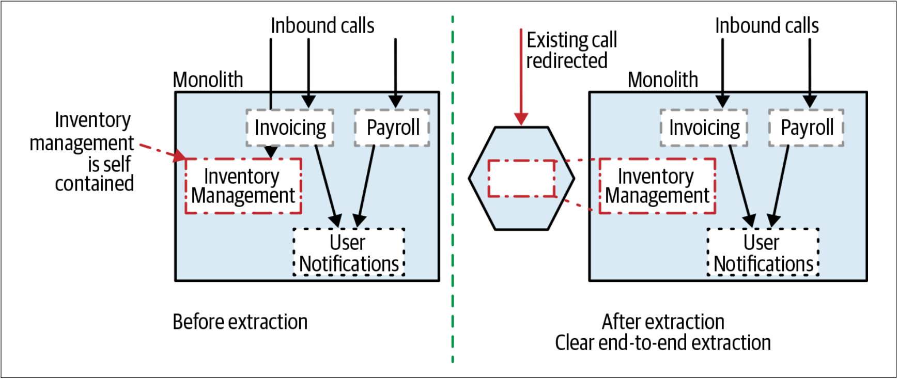
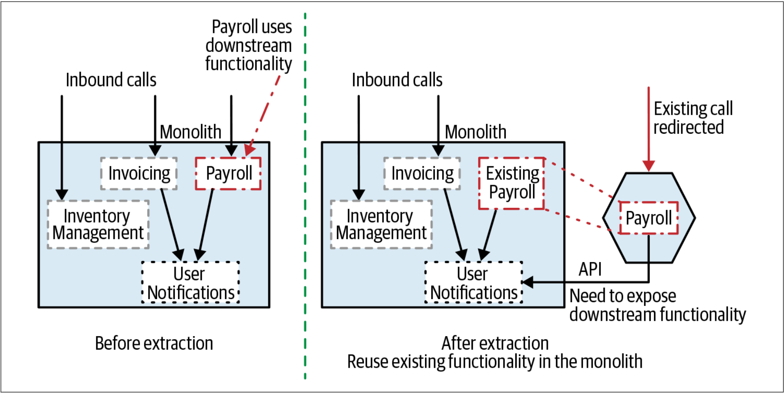

# 绞杀者模式
绞杀者模式是一种系统重写的常见技术。[Martin Fowler](https://martinfowler.com/)从某种藤类植物汲取灵感，并首次提出了[绞杀者模式](https://martinfowler.com/bliki/StranglerFigApplication.html)。这种藤生长于树上部的树枝，然后朝着地面的方向生长并落地生根，最后逐渐包围原来的树木。这种藤所包围的树为新的藤提供最初的结构支撑，并且如果到最后阶段，我们可能会看到原来的树死了、并且腐烂了，只剩下了新的、现在自支撑的藤。



**Martin Flower博客中提到的绞杀藤图片**



与此类似，在软件开发中，我们的新系统最初应由现有系统支持和包装。这个主意就是：新、旧系统可以共存，给予新系统成长的时间，并完全替代旧系统。我们将很快看到，这种模式的主要好处是它支持我们增量迁移到新系统的目标。而且，这种模式使我们在可以利用已经发布的新系统的优势的同时，具备暂停甚至完全停止迁移的能力。

很快就会看到，当我们在软件中实现绞杀者模式时，我们不仅要努力朝着新的应用程序架构迈进，而且还要确保每一步都易于逆转，从而降低每一步的风险。

## 绞杀者模式是如何工作的
虽然绞杀藤模式通常用于从一个单体系统迁移到另一个单体系统，但我们希望利用绞杀藤模式将单体系统迁移到一系列微服务。这可能涉及从单体中复制代码（如果可能），或者重新实现所讨论的功能。另外，如果所讨论的功能需要状态的持久化，则需要考虑如何将该状态迁移到新服务，并需要考虑如何再将该状态迁移单体。我们将在第4章中探讨与数据相关的迁移模式。

如[图3-1](#f31)所示，实现绞杀者模式需要三个步骤：

1. 首先，确定现有系统中要迁移的部分。需要使用我们在[第2章](Trade_Offs.md)中讨论的那种权衡方式，来判断要首先解决系统的哪些部分。
2. 然后，需要在新的微服务中实现此功能。
3. 在准备好新的实现之后，需要能够将调用从单体重新路由到新的微服务。

图3-1. 绞杀者模式概览

值得注意的是，在将调用重定向到迁移之后的服务之前，即使已将新功能部署到生产环境中，从技术而言，该新功能也还是没有启用的。这意味着我们可能会花一些时间来正确使用该功能，并在一段时间内实现该功能。我们可以将这些更改推送到生产环境中，并在了解到我们尚未使用新服务的情况下而对更改感到安全。这也让我们对新服务的部署和管理感到满意。一旦新服务实现了与单体一样的等效功能，就可以考虑使用类似并行运行（*parallel run*）的模式（稍后将探讨并行运行模式），让我们确信新功能可以按照预期运行。



区分部署（*deployment*）和发布（*release*）的概念非常重要。仅仅j把软件部署到给定的环境并不意味着用户实际上正在使用它。将这两件事视为独立的概念，可以在服务使用前在最终的生产环境中验证软件的能力，从而可以降低新软件的风险。类似绞杀者的模式，并行运行（*parallel run*）和金丝雀发布（*canary release*）之类的模式就利用了部署和发布是独立活动这一事实。



这种绞杀者方法的关键点不仅在于我们可以逐步将新功能迁移到新系统，并且如果需要，我们还可以非常轻松地回滚此变更。记住，我们都会犯错，因此我们希望拥有一种技术，使我们不仅可以尽可能低成本地犯错误（因此会有很多小步骤），而且还可以快速修正错误。

如果单体内部的其他功能也会用到正在抽取的功能，则我们还需要更改这些调用的方式。 我们将在本章的后面介绍一些技术用于解决这种场景。

## 何处使用绞杀者模式
绞杀者模式可让我们在无需触碰或修改现有系统的情况下将功能迁移至新的服务架构。当现有的单体还由其他人一起开发时，绞杀者模式可以减少不同人员之间的冲突。当单体程序实际上是一个黑盒系统（例如，第三方软件或SaaS服务）时，绞杀者模式也非常有用。

有时，我们可以一次提取一个完整的、端到端的、功能切片，如[图3-2](#f32)所示。除了对数据的担忧之外，这大大简化了功能抽取的过程。我们将在本书的后面部分介绍数据相关的内容。

图3-2. 库存管理功能的简单的端对端的抽象

为了执行这种整洁的（*clean*）端到端抽取，我们可能倾向于提取更大的功能组以简化该过程。这可能会导致一个比较棘手的平衡——抽取更大的功能切片，将会承担更多的工作，但会简化某些集成的挑战。

如果我们确实想“蚕食”，我们可能需要考虑更多的“浅”抽取，如[图3-3](#f33)所示。此时，我们会抽取Payroll功能，但是实际上，Payroll功能会依赖仍旧位于单体中的其他功能，例如此例中的发送用户通知的功能。

图3-3. 抽取仍需要依赖单体的功能

我们没有重新实现User Notifications功能，而是通过从单体公开了该功能，从而向我们的新微服务提供了User Nofitifications功能——显然，这需要对单体本身作出更改。

我们没有重新实现User Notifications功能，而是通过从单体公开了该功能，从而向我们的新微服务提供了User Nofitifications功能——显然，这需要对单体本身作出更改。

但是，为了使绞杀者模式可以发挥作用，我们需要理清我们关注的功能到我们希望迁移的部分的[入站](Domain_Driven_Design.md#fn_译注3)调用图。例如，在[图3-4](#f34)中，我们理想的情况是迁移给用户发送User Notifications的功能到一项新服务中。但是，由于该通知由现有单体的多个入站调用而触发，因此，我们无法清晰地重定向来自系统外部的调用。取而代之的是，我们需要研究一种类似于第104页[^译注1]的“[抽象分支模式](Pattern_Branch_by_Abstraction.md)”中所述的技术。

图3-4. 当要迁移的功能位于现有系统的较深的层次时，则绞杀者模式无法发挥作用

我们还需要考虑对现有系统进行请求的调用的性质。正如我们稍后将探讨的，类似HTTP之类的协议非常适合**重定向**。

HTTP本身具有内置的透明重定向的概念，代理可以使用该概念来清晰的了解入站请求的性质并做出对应的转发。其他类型的协议（例如某些RPC）则可能不太适合重定向。我们需要在代理层做的用来理解并转发入站调用的功能越多，则此协议的可行性越小。

尽管有这些限制，但绞杀者模式一次又一次地证明了自己是一种非常有用的迁移技术。作为一种轻巧易用、且易于处理增量变更的方法，在探索如何迁移系统时，绞杀者模式通常是我的首选方法。

---
[^译注1]: 此处对应的是英文原书的第104页，而不是翻译之后的页数。
[^译注2]: smart endpoints and dumb pipes: https://martinfowler.com/articles/microservices.html#SmartEndpointsAndDumbPipes