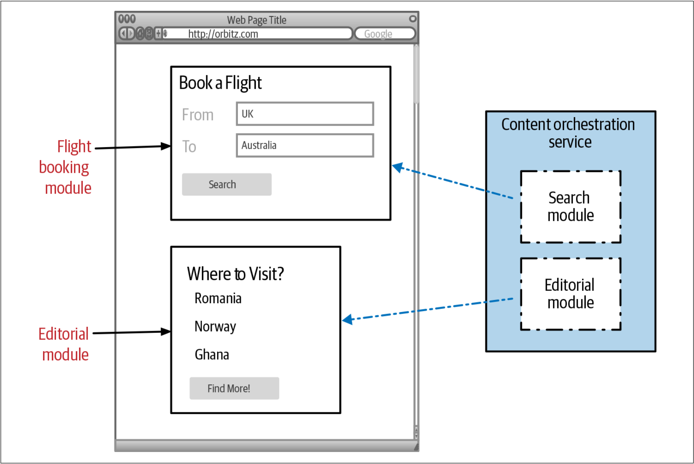
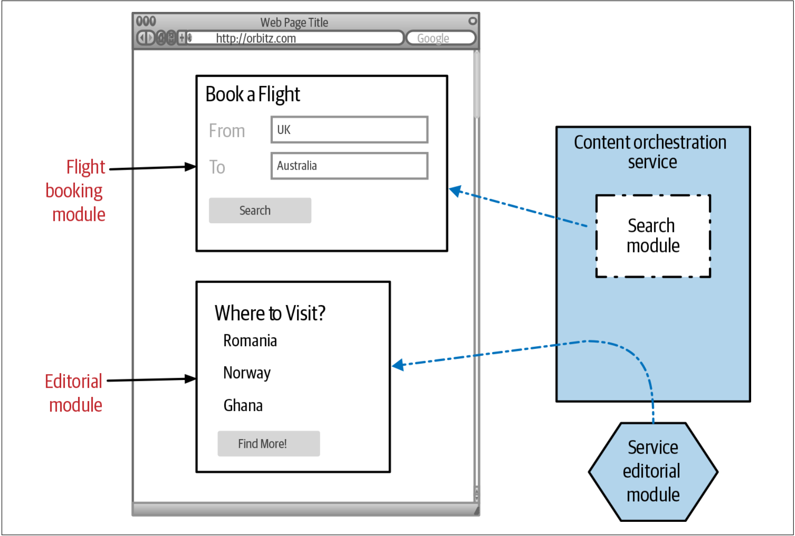

# UI组合模式
到目前为止，我们所考虑的技术主要是用于服务端的增量迁移工作，但是前端UI（*user interface*）为我们提供了一些有用的机会可以把来自于现有单体或新的微服务架构中的部分功能整合起来。

多年以前，我参与了一个项目，该项目用来帮助《英国卫报》的在线版将其现有的内容管理系统迁移到新的、基于Java的定制平台。迁移过程将与发布新风格的在线报纸并行进行，新风格的在线版本是配合印刷版的重新发行而开展。我们希望采用增量迁移的方法，我们针对不同的垂类（旅行，新闻，文化）把现有CMS到全新网站的过渡拆分为多个阶段。即使在这些垂类内部，我们也寻找机会将迁移拆分成较小的部分。

最终，我们使用了两种有用的组合技术（*compositional techniques*）。通过与其他公司的交流，我越来越发现，过去几年来，这些技术的变化是许多组织采用微服务架构的重要组成部分。

## 页面组合的例子
在《英国卫报》的迁移项目中，尽管我们推出了单独的widget（稍后将讨论widget），但迁移计划始终还是基于页面的迁移，以便使全新的网站风格得以实现。基于页面的迁移是按照垂类来进行的，Travel垂类是我们迁移的第一个页面。在此过渡时间内，用户在访问网站的新部分时会看到和老版本不同风格的页面。在该过程中，我们还费尽心思来确保所有旧页面的链接都重定向到了新位置（新页面的URL已经发生变化）。

几年后，当《英国卫报》改变其技术以摆脱目前的Java单体架构时，他们再次使用了类似的、一次迁移一个垂类的技术。这次迁移，他们使用更快的CDN来实施新的路由规则，从而可以像使用内部代理一样有效地使用CDN。[^3]

作为提供房产在线交易的澳大利亚公司，REA公司拥有不同的团队来分别负责商业地产和住宅地产，并且每个团队都拥有其完整的渠道。在这种情况下，因为团队可以拥有整个端到端的体验，因此基于页面的组合方法是有效的。实际上，REA公司为不同的渠道采用了完全不同的品牌，这意味着基于页面的拆分更加有意义，此时可以为不同的客户群体提供完全不同的体验。

## widget组合的例子
在《英国卫报》的升级中，Travel垂类是第一个要迁移到新平台的页面。之所以这样做，部分原因是因为Travel垂类在分类方面遇到了一些有趣的挑战，同时Travel垂类也并不是该网站中最引人注目的部分。我们希望上线某些迁移，并从迁移中汲取经验，但同时也要确保如果出现问题，不会影响网站的主要部分。

《英国卫报》的旅行部分涵盖了世界各地的、迷人的目的地的深入报到。我们没有采用整体迁移旅行部分的方案，反之，我们希望能发布更多的低调的版本来测试系统。我们部署了一个单独的widget来显示新系统定义的旅行目的地的TOP 10榜单。如[图3-19](#f319)所示，将该widget拼接到旧的旅行页面。在该案例中，我们采用Apache服务器，并使用了一种称为Edge-Side Includes（ESI）[^译注1]的技术。使用ESI技术，可以在网页中定义模板，然后Web服务器会对此处的内容进行拼接。


<span id='f319'>图3-19</span>. 使用ESI技术来拼接来自新的CMS系统的内容


**ESI技术**

ESI语言是基于XML标签的标记语言，用于改善HTTP中间件加载大量Web内容缓存时造成的性能下降。开发者可以把页面的动态内容替换为ESI标签，从而实现缓存的多样化。当用户请求该页面时，代理服务器会解析处理ESI标签，获取内容，从而有效减轻后端服务器的压力。

举个例子，有一个查询天气的网站，网站会定时缓存城市天气页面的内容，如下图，可以用ESI标签代替获取动态数据的参数。


上面这个例子的HTML可以是如下的样子：

```html
<body>
  <b>The Weather Website</b>
  Weather for <esi:include src="/weather/name?id=$(QUERY_STRING{city_id})" />
  Monday: <esi:include src="/weather/week/monday?id=$(QUERY_STRING{city_id})" />
  Tuesday: <esi:include src="/weather/week/tuesday?id=$(QUERY_STRING{city_id})" />
  <!--
    ...
  -->
```

但是，ESI也有自己的问题。例如，HTTP中间件服务器不能正确识别ESI标签是来自上游服务器还是恶意用户，换句话说，攻击者可以注入恶意ESI标签，HTTP中间件会相信标签来自上游服务器，并且盲目解析并且转发。

因此，在使用ESI技术时，在获得ESI带来的便利的同时，也要注意ESI的负面影响。


如今，仅在服务器端拼接widget似乎非常少见了。这主要是因为基于浏览器的技术已经变得更加复杂，从而使得浏览器（或native app）自己就可以完成更多的页面组合。这意味着，对于基于widget的Web UI而言，浏览器经常会使用多种技术来多次调用并加载各种widget。这样做的另一个好处是，如果一个widget无法加载——可能是由于后端服务不可用——但是，其他widget仍然可以展现。此时，仅导致部分服务降级，而非全部服务降级。

对于《英国卫报》而言，尽管最后我们主要使用基于页面的组成，但许多其他的公司却大量使用基于widget的组合技术。例如，Orbitz（现在已被Expedia收购）就创建了专用服务来为单个widget提供服务[^4]。在转向微服务之前，Orbitz网站就已经拆分为独立的UI “modules”（Orbitz是这样对其命名的）。这些模块可以表示：搜索表单，预订表单，地图等。如[图3-20](#f320)所示，这些UI模块最初直接由Content Orchestration服务来提供。



<span id='f320'>图3-20</span>. 在迁移到微服务之前，Orbitz的Content Orchestration服务为所有的模块提供服务

 Content Orchestration服务实际上是一个庞大的单体。所有拥有这些模块的团队都必须协调在单体内部所作的变更，从而导致发布变更存在大量延期。这是我在[第1章](What_Are_Microservices.md)中强调的交付冲突问题的经典案例：每当团队必须协调其他团队才能推出变更时，变更成本就会增加。为了实现更快的发布周期，当Orbitz决定尝试微服务时，他们聚焦于根据这些模块来进行服务拆分，并且从editorial模块开始开启迁移之旅。如[图3-21](#f321)所示，Content Orchestration服务的功能已经变成已迁移到微服务的模块访问其下游服务的代理。

 

 <span id='f321'>图3-21</span>. 每次迁移一个模块，Content Orchestration服务成为新服务的代理

前端UI已经按照这些模块进行了视觉拆分，这一事实让Orbitz的微服务迁移的工作更容易以增量方式来开展。由于各个独立模块之间已经拥有清晰的owner，因此这进一步帮助了迁移工作，从而使得可以在不干扰其他团队的情况下更轻松地执行迁移。

值得注意的是，并非所有的UI都适合拆分为新的widget，但是在可以的情况下，这会使得增量迁移到微服务的工作变得更加容易。

### 移动应用
尽管我们主要讨论基于Web的UI，但是其中的一些技术也可以很好地适用于手机客户端。例如，Android和iOS都提供了UI组件的功能，从而更容易隔离这些UI组件，或以不同方式重新组合这些UI组件。

部署原生移动应用程序的变更的挑战之一是：Apple App Store和Google Play商店都要求提交应用的新版本并对其审核，只有审核通过之后，用户才能更新到应用的新版本。尽管在过去的几年，应用商店签发应用程序的时间已大大减少，但这仍然增加了部署应用新版本的时间。

以此观之，APP本身也是一个单体：如果要更改APP的某一个单独的部分，则仍然需要部署整个APP。并且还必须考虑以下事实：用户必须下载APP的新版本才能看到新功能——使用基于Web的应用程序时，我们通常无需处理这些事情，因为更改可以无缝地交付给用户的浏览器。

为了解决如上提到的问题，对现有的APP而言，许多公司都允许无需重新部署APP的新版本就能实现动态变更。通过在服务器端部署更改，客户端可以立即看到新功能，而不必部署APP的新版本。尽管有些公司会使用更复杂的技术，但可以使用web view之类的方法轻松实现这一目标。


**APP审核是好还是不好？**

对于国内而言，Android应用商店的审核还是非常快的。并且，有些Android应用的驱动是开发者可以自己控制的，这使得Android应用的发布会更快速。

但是iOS应用就没有这么幸运了。对于非越狱的iOS设备，苹果要求，所有的应用程序都必须来源于苹果的App Store。然而，每次提交应用到App Store的时候，整个的审核周期有时候又是非常漫长的。这会导致如果App出现一个只能发版才能解决的问题，那么这个问题的收敛可能就会非常慢。因此，为了应对这种问题，出现了很多热更新技术或插件技术，比如之前的JSPatch技术。不过，后来，苹果也针对这种行为做过严厉的打击。

在我看来，虽然对于开发者而言，审核会增加应用更新的时间，对于开发者是不友好的。但是对于用户而言，审核是整个应用生态的必须手段。因为审核的存在，利用公司的了力量来打平了用户的能力，从而实现为用户赋能。并非所有的用户都具备很高的安全意识或者掌握很高深的计算机技术，如果没有审核的存在，对于用户而言，无疑是一场噩梦。2020年，央视的315晚会上就曝光了部分SDK会窃取用户隐私的现象。但是，对于iOS设备而言，这种窃取的现象还是比较少见的。

多年之前，也流行过一句笑话：如果想买苹果的产品，不需要做太多的比较，你就说你想买什么价位的就行。

因此，我向来非常支持苹果的严格的审核制度，并且这种审查制度的规则的公开透明的。另外，从一定程度上，这种审查会促使开发者更加重视应用的质量，因为一旦出现BUG，那么修复起来的周期可能会比较长。


Spotify在所有平台上的UI都是高度面向组件（*component-oriented*）的，包括其iOS和Android应用程序。我们看到的几乎所有内容都是一个单独的组件：从简单的文本标题，到专辑封面甚至是播放列表[^5]。这些模块中的某些模块又由一个或多个微服务来支持。在服务器端，以声明的方式来定义这些UI组件的配置和布局。Spotify工程师无需向应用商店提交APP的新版本就能够改变用户所看到的界面并快速回滚这些变更。这使他们可以更快地进行实验并尝试新功能。

## 微前端的例子
随着网络带宽和Web浏览器能力的提升，运行于浏览器中的代码的复杂性也不断提高。现在，许多基于Web的UI都使用某种形式的单页应用程序（*SPA: single page application*）框架，从而消除了由不同网页组成应用程序的概念。此时，我们拥有一个功能更强大的UI，其中所有内容都运行于一个窗口——以前这种浏览器内（*in-browser*）的用户体验只有利用类似Java Swing这样的较重的UI SDK才能实现。

利用单个页面提供整个界面，我们显然不能再考虑基于页面组合的技术了，因此我们必须考虑某种形式的基于widget的组合技术。已经做了很多尝试来为web编写通用widget。最近，[Web Components规范](https://www.webcomponents.org/specs)正在尝试定义支持跨浏览器的标准组件模型。但是，经过很长时间之后，Web Components标准才流行起来，其中的一个绊脚石是浏览器的支持。


对于Web Componets标准中的shadow dom技术而言，各浏览器的支持情况如下图所示：


不同浏览器对其他技术的支持情况，可以参考站点[Can I Use](https://caniuse.com/)。


人们并没有坐等Web Components来解决问题，而是使用诸如Vue，Angular或React之类的单页面应用程序框架来解决问题。另外，许多人试图解决如何把SDK构建的UI模块化的问题，其中这些SDK最初设计为拥有整个浏览器窗口。这导致人们朝着某些人所谓的[微前端（*Micro Frontends*）](https://micro-frontends.org/)的方向发展。

乍一看，Micro Frontends实际上只是将UI拆分为相互独立的不同组件。然而，在这一方面上，Micro Frontends并不是什么新鲜的技术——在我出生之前，面向组件的软件就已经出现好几年了！更有意思的是，人们正在研究如何让Web浏览器，SPA SDK和组件化可以协同工作。如何精确地利用Vue和React创建单个UI，而又在其依赖不发生冲突时，仍然允许它们可以共享信息？

深入讨论微前端超出了本书的范围，部分原因是根据使用的SPA框架的不同，完成此工作的方式也会有所不同。但是，如果发现自己要拆解单页应用程序时，那么我们并不孤单，已经有很多人为此提供了共享技术和库来完成这项工作。

## 何处使用
作为允许系统可以*迁移到新技术平台*[^译注2]的一种技术，UI组合非常有效，因为它允许迁移功能的整个垂类部分。但是，要使其正常工作，需要具有改变现有UI的能力，以允许我们可以安全的插入新功能。本书稍后将介绍组合技术，但值得注意的是，可以使用哪种技术通常取决于实现UI所采用的技术的特性。一个好的、老式的网站可以让UI组合变得容易，而SPA技术的确增加了一些复杂性，并且还常常存在一系列令人困惑的实现方法！

[^3]: It was nice to hear from Graham Tackley at The Guardian that the “new” system I initially helped implement lasted almost 10 years before being entirely replaced with the current architecture. As a reader of the website, I reflected that I never really noticed anything changing during this period!
[^4]: See Steve Hoffman and Rick Fast, [“Enabling Microservices at Orbitz”](http://bit.ly/2nGNgnI), YouTube, August 11, 2016.
[^5]: See John Sundell, [“Building Component-Driven UIs at Spotify”](http://bit.ly/2nDpJUP), published August 25, 2016.

[^译注1]: ESI Language Specification 1.0: https://www.w3.org/TR/esi-lang/.
[^译注2]: re-platforming，译为采用新的技术栈来实现现有技术栈实现的系统。