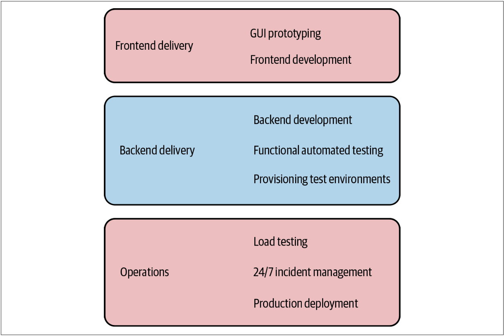
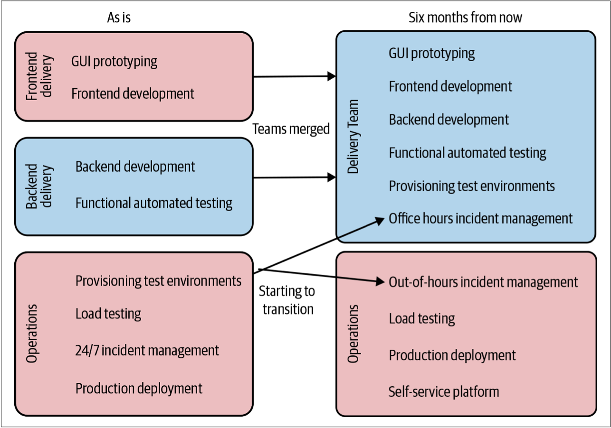
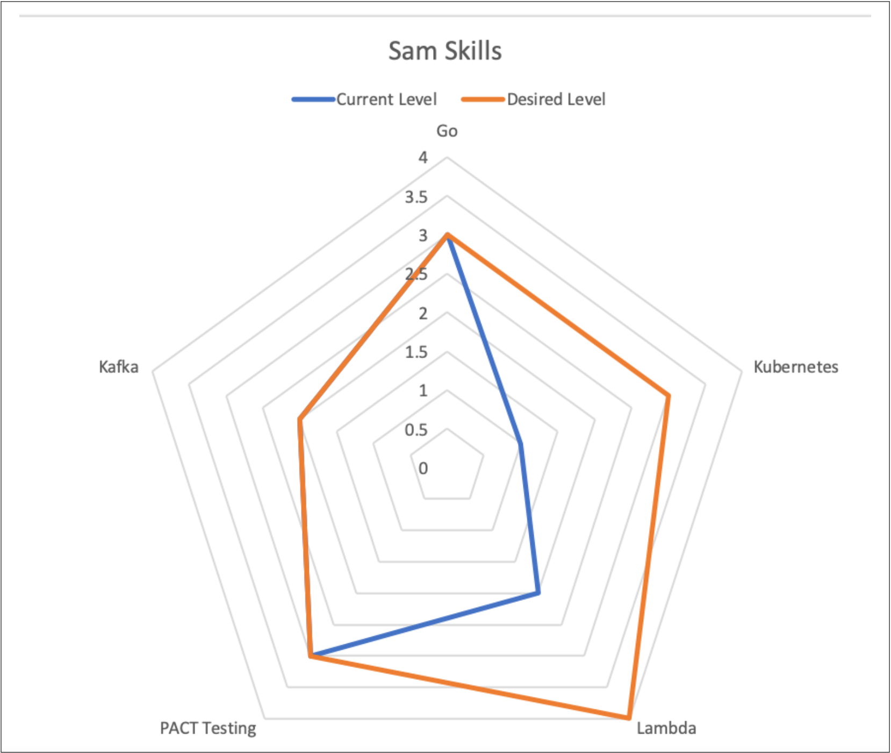

# 重组团队

本章之后，我们将主要着眼于需要对架构和代码进行的变更，以成功实现向微服务的过渡。但是，正如我们已经探索的那样，使架构和组织保持一致对于充分利用微服务架构至关重要。

但是，我们可能处于需要组织变革以利用这些新技术的情况。尽管对组织变革的深入研究不在本书的讨论范围之内，但在我们深入探讨技术之前，我会对组织变革方面提供些许意见。

## 转变组织结构
过去，我们围绕核心技能构建IT组织。Java开发人员与其他Java开发人员处于一个团队中。测试人员与其他测试人员处于一个团队。DBA自己一个团队。在开发软件时，需要从不同的团队指派人员来为这些周期很短的计划而工作。

因此，软件开发需要团队之间的多次交接。商业分析师会与客户沟通并发现客户需求。然后，分析师写下需求并将其交给开发团队。开发人员会完成一些工作并将其交给测试团队。如果测试团队发现问题，则将其打回。如果测试通过，则可以继续交给运维团队来部署。

这种组织的孤岛化似乎很熟悉。考虑我们在上一章中讨论的分层架构。进行简单更改时，分层架构可能需要更改多个服务。组织孤岛也是如此：开发或更改软件所需的团队越多，花费的时间就越长。

需要打破这些组织孤岛。对于许多组织而言，专职的测试团队现在已成为历史。相反，测试专家正在成为交付团队不可或缺的一部分，从而开发和测试可以更加紧密地合作。DevOps运动也部分导致许多组织从集中式运维团队转移到其他方面，而将更多的运维责任推到交付团队。

在将这些专职团队的角色推到交付团队的情况下，这些集中式团队的角色已经转移：从自己完成工作，变成帮助交付团队完成工作。这可能需要：不同的专家深入到交付团队，创建自助服务工具，提供培训以及其他一系列活动。这些集中式团队的责任已经从做事转移到了赋能。

因此，我们看到越来越多的独立自主团队能够比以往更多地负责端到端的交付周期。他们关注的重点是产品的不同区域，而不是特定的技术或活动——就像我们从面向技术的服务转向围绕业务垂直功能的服务建模一样。现在，需要了解的重要一点是：尽管这种转变是多年来一直很明显的明确趋势，但却并没有普及开来，也不是一种可以快速完成的转变。

## 没有放之四海而皆准的模式
在本章的开头，我们讨论了如何决定是否使用微服务应取决于面临的挑战以及希望带来的变化。变更组织结构也同样重要。了解我们的组织是否需要变革以及需要如何变革，依赖于我们的背景、工作文化和团队人员。这就是为什么仅复制别人的组织设计会特别危险的原因。

之前，我们非常简短地谈到了Spotify模型。Henrik Kniberg和Anders Ivarsson于2012年发表了著名的论文“[**Scaling Agile @ Spotify**](https://blog.crisp.se/wp-content/uploads/2012/11/SpotifyScaling.pdf)”。文章中提及的*Spotify如何组织自己*得到了越来越多的关注。该文章普及了分队（*Squads*），分会（*Chapters*）和协会（*Guilds*）的概念，这些术语现在软件开发行业中很普遍了（尽管被误解了）。最终，人们称这种模型为“Spotify模型”，尽管Spotify从未使用过“Spotify模型”这样的术语。

随后，大量公司采用了Spotify这样的结构。但是，与微服务一样，许多公司还没有充分思考就倾向于使用Spotify模型，此处的思考包括：Spotify的运营环境，商业模型，面临的挑战或公司的文化。事实证明，对于一家瑞典的音乐流媒体公司可以运作良好的组织结构可能并不适用于投资银行。此外，“Scaling Agile @ Spotify”还简要介绍了Spotify在2012年的运作方式，并且此后情况发生了变化。事实证明，甚至连Spotify也不使用Spotify模型。

同样的道理也适用于我们微服务的变革工作。绝对可以从其他组织的工作中汲取灵感，但不要以为对其他人有用的东西会在我们的背景下起作用。关于Spotify模型，就像Jessica Kerr所说：“[**复制问题，而不是答案**](https://twitter.com/jessitron/status/1000347112331149312)”。Spotify的组织结构反映了其为解决其问题而进行的变革。在我们做事、尝试新事物时，学习那种灵活的、质疑的态度，但要确保我们应用的变革是植根于：对公司的理解，对公司需求的理解，对公司员工的理解，和对公司文化的理解。

举一个具体的例子，我看到很多公司对他们的交付团队说：“现在你们都需要部署软件并提供24/7的全天候支持。”这可能是及其混乱的并且毫无帮助。有时，做出大胆的声明可能是使事情前进的好方法，但要为其可能带来的混乱做好准备。如果我们在这样的环境中工作：开发人员习惯于朝九晚五（*9-5*）的工作，而不是随时待命，从未在支持或运维环境中工作，并且对SSH也并未了如指掌。那么如上的声明是一种疏远员工并使他们离职的一种很好的方式。但是，如果我们认为24/7的全天候支持是适合我们的组织的正确举动，那就太好了！但是，将其作为一种愿望、作为我们要实现的目标来谈论，并说明原因。然后与员工一起努力实现该目标。

如果真的想转向更加完全拥有软件整个生命周期的团队，需要认识到团队的技能需要改变。可以向团队提供帮助和培训，也可以向团队增加新成员（把当前运维团队的成员嵌入到交付团队）。就像我们的软件一样，无论要带来什么变化，我们都可以以增量变化的方式实现这一目标。

> 
DevOps并不意味着没有运维

> 围绕DevOps，有很多普遍的误区。有人认为DevOps意味着开发人员执行所有操作，而无需运维人员。事实并非如此。从根本上说，DevOps是一种文化运动，其基础是打破开发和运维之间的障碍。我们可能仍然希望由专家担任类似运维的这些角色，或者可能不需要。但是无论想做什么，都希望促进与交付软件有关的人员达成共识，无论他们的具体职责是什么。
> 
> 有关此方面的更多信息，我推荐参考《团队拓扑》[^9]，该书探讨了DevOps的组织结构。有关该主题的另一个很棒的资源是《Devops手册》[^10]，但是该手册的涉及面更广。

## 做出改变
因此，如果不是单纯的复制别人的组织结构，那应该从何处开始呢？当与正在改变交付团队角色的组织合作时，我打算从明确列出该公司交付软件所涉及的所有行为和职责开始。然后，将这些行为映射到现有的组织结构。

如果已经对生产路径进行了建模（我非常支持），则可以在现有视图上覆盖这些行为和职责的所有权边界。另外，如图2-9所示的一些简单的事情，也可以很好地工作。仅从所有涉及到的角色中选择[**利益相关者**](Domain_Driven_Design.md#fn_译注2)，然后组成一个小组来集体“头脑风暴”公司软件发布的所有行为活动。

图2-9. 一个交付相关职责的子集以及如何将其映射到现有的团队

对当前“现状”拥有[图2-9](#f29)所示的这种理解非常重要，因为这可以帮助每个人对所涉及的所有工作达成共识。孤岛性组织的本质是，当处于不同的部门时，可能很难理解另一个部门的工作方式。我发现[图2-9](#f29)所示的方式确实有助于组织真实的认识到变化的速度可以有多快。我们可能会发现，并非所有团队都是平等的——从测试到部署的过程，有些团队可能已经为自己做了很多事情，有些团队可能完全依赖其他团队。

如果交付团队已经在为自测和用户测试而自行部署软件，那么部署到生产环境的步骤可能不会那么大。另一方面，我们仍然必须考虑获得1级支持（携带传呼器）的影响，例如定位线上问题等。这些技能依赖人们多年工作的积累，期望开发人员在一夜之间就具备这些技能是完全不现实的。

一旦有了现状图，就可以在某个合理的时间范围内重新规划未来的情况。我发现需要六个月到一年的时间来尽可能深入的详细讨论：

* 哪些职责正在交接？
* 如何实现这种过渡？
* 要实现这一转变需要什么？
* 团队需要什么新技能？
* 要进行的各种更改的优先级是什么？

以图2-9所示的现状为例，在图2-10中，我们决定合并前端团队和后端团队的职责。我们还希望团队能够自己提供测试环境。但是要做到这一点，运维团队需要提供一个自助服务平台供交付团队使用。我们希望交付团队最终能够处理软件的所有支持，因此我们希望使团队更加满意所从事的工作。让交付团队拥有自己的测试部署是一个很好开端。我们还决定，交付团队将在工作日内处理所有的软件问题。因为在工作日，运维团队可以为交付团队提供指导，从而可以有机会为交互团队提供一个安全的环境以加速组织融合的进度。

图2-10. 我们想要如何在组织内部重新分配职责的一个例子

在开始进行的变革时，全局试图确实可以提供帮助，但是还需要花时间与团队成员一起确定这些变革是否可行，如果可行，如何进行变革。通过将变革划分为特定职责，我们还可以采用增量方式来实现变革。对于我们而言，首先要集中精力消除由运维团队提供测试环境的需求，这是正确的第一步。

## 改变技能
在评估团队成员需要的技能并帮助他们缩小差距时，我非常喜欢让人们进行自我评估，并以此对团队可能需要什么支持来进行变革有更广泛的了解。

一个具体的例子是：我在ThoughtWorks工作期间参与的一个项目。我们受雇来帮助《英国卫报》重建其在线版的风格（下一章将会介绍）。为此，《英国卫报》的在线版团队需要掌握新的编程语言及相关技术。

在项目开始时，我们的联合团队提出了一系列核心技能，这些技能对于《英国卫报》的开发人员的工作至关重要。然后，每个开发人员都根据这些标准进行自评，并以1-5分制给自己打分：1意味着一无所知，5意味着可以为此写一本书。每个开发人员的分数都是私密的，且仅与指导他们的人共享。我们的目标不是要求每个开发人员都应该将每个技能提高到5分。我们的目标更多的是：开发人员自己为将要达到的分数设定目标。

作为教练，我的职责是确保：如果我所指导的开发人员想要提高Oracle技能，我将确保他们有机会能够提高其Orcale技能。这可能涉及：

* 确保他们可以在使用该技术的需求开发中工作
* 为他们推荐学习视频
* 考虑让他们参加培训课程或会议
* ……

可以使用自评来建立一个可视化的技能雷达图用以显示：人们可能希望将自己的时间和精力专注于在哪一技能区域。如图2-11所示，该例说明：我确实想将自己的时间和精力集中在提高Kubernetes技术水平和Lambda技术水平，这也许表明我现在必须自己管理软件发布的事实。在图中突出我们目前对自己的哪方面的技能感到满意同样重要。图2-11的自评显示，Go编码不是现在需要关注的技能。

图2-11. 一个技能雷达图的例子，用以显示我希望提升哪些技能

保持这种自评结果的隐私性非常重要。关键不是要别人对自己进行评分，关键是为了帮助员工指导自己的发展。公开这种内容将大大改变自评的结果。例如，突然间，人们会担心自己的分数太低以至于可能会影响到绩效考核。

尽管每个人的打分是私密的，但是仍然可以用其来建立整个团队的自评图。获得匿名的自我评估等级，并为整个团队制定技能图。团队的技能图可以帮助突出显示那些需要在系统层面上解决的技能提升需求。如图2-12所示，虽然我可能对自己的PACT技能比较满意，但团队整体却希望在该领域进一步提高，同时Kafka和Kubernetes是另外的需要重点关注的领域。团队技能图会突出表明对小组学习的需求，或表明可能需要进行更大的投资，例如举办内部培训课程。与团队共享总体情况还可以帮助个人了解他们为帮助整个团队找到所需平衡而做出的贡献。

图2-12. 从团队整体情况看，需要提升Kafka, Kubernetes以及PACT Testing[^译注1] 技能

当然，改变现有团队成员的技能并不是唯一的方法。我们通常针对的是可以承担更多职责的一支交付团队。因此，这不一定意味着每个人都在做更多的事情。正确的方法可能是让拥有所需技能的新员工加入团队。我们可以聘请Kafka专家加入团队，而不是帮助开发人员学习更多有关Kafka的知识。引入新成员的方式可以解决团队的短期问题，然后团队将拥有一个团队内专家，该专家还可以帮助其他人在该领域学习到更多技能。

关于改变技能的主题，可以有更多内容去探讨，但我希望我已经分享了足够的内容以帮助大家入门。首先要了解我们自己的员工和文化，以及用户的需求。一定要从其他公司的案例研究中得到启发，但是如果大胆复制他人的方案对我们不起作用时，也不要感到惊讶。

---
[^9]: Manuel Pais and Matthew Skelton, Team Topologies (IT Revolution Press, 2019).
[^10]: Gene Kim, Jez Humble, and Patrick Debois, The DevOps Handbook (IT Revolution Press, 2016).
[^译注1]: [**PACT**](https://github.com/pact-foundation)：一个开源契约测试框架，最早是由澳洲最大的房地产信息提供商REA Group的开发者及咨询师们共同创造。REA Group的开发团队很早便在项目中使用了微服务架构，并在团队中对于敏捷和测试的重要性早已形成共识，因此设计了Pact框架。Pact工具于2013年开始开源，发展到今天已然形成了一个小的生态圈，包括各种语言（Ruby/Java/.NET/JavaScript/Go/Scala/Groovy...）下的Pact实现，契约文件共享工具Pact Broker等。Pact的用户已经遍及包括RedHat、IBM、Accenture等在内的若干知名公司，Pact已经是事实上的契约测试方面的业界标准。