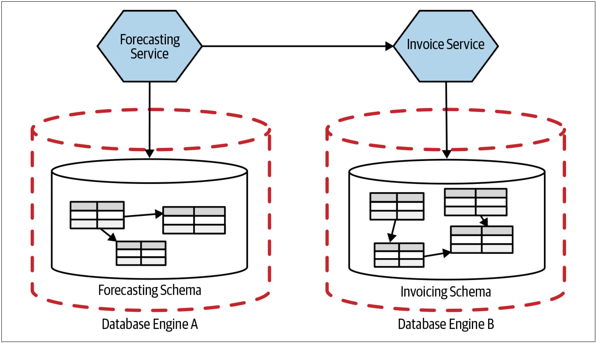

# 拆分数据库

我们已经详细讨论了使用数据库作为集成多种服务所面临的挑战。现在应该很清楚了，我不是这种方法的粉丝！这意味着，在数据库中，我们也需要找到[接缝](To_Change_the_Monolith_or_Not.md#重构单体)，以便可以对其进行清晰的拆分。但是，数据库拆分是一件很难处理的事情。在介绍某些拆分方法的示例之前，我们应该简要讨论数据库的逻辑分离和物理部署之间的关系。


接缝（*seam*）是Michale在[《修改代码的艺术》](https://www.oreilly.com/library/view/working-effectively-with/0131177052/)一书中提出的概念。接缝是指程序中的特殊的点，在这些点上，无需做任何修改就可以改变程序的行为。本质而言，可以围绕要更改的代码段定义接缝，对该接缝进行新的实现，并在变更完成后用新的实现替换旧有的实现。Michael把使用接缝来安全的工作的技术作为帮助清理代码库的一种方式。


## 数据库的物理分离 VS 逻辑分离
当我们谈论拆分数据库时，我们主要是在试图实现数据库的逻辑分离。 如[图4-24](#f424)所示，单个数据库引擎完全能够承载多个逻辑上分离的schema。

图4-24. 两个服务使用运行在同一个物理引擎之上的相互分离的逻辑schema

更进一步，我们可以把每个逻辑schema置于单独的数据库引擎，这也给我们带来了数据库的物理分离，如[图4-25](#f425)所示。

图4-25. 两个服务使用运行在分离的物理引擎之上的分离的逻辑schema

为什么要在逻辑上拆分schema，但却仍然将这些schema置于单个数据库引擎上呢？好吧，从根本上讲，逻辑拆分和物理拆分可以实现不同的目标。逻辑拆分可以实现更为简单的独立变更和信息隐藏；而物理拆分则可以提高系统的鲁棒性，同时还可以帮助消除资源冲突，从而提高吞吐量或降低延迟。

如[图4-24](#f424)所示，当我们在逻辑上拆分数据库schema，但让他们继续位于相同的物理引擎时，我们就存在单点故障的风险。如果数据库引擎出现故障，则两个服务都会受到影响。但是，没那么简单。许多数据库引擎都具有避免单点故障的机制，例如：多主数据库模式，温备故障转移机制（*warm failover mechanisms*）等。实际上，在组织中，已经付出了巨大的努力来创建高弹性数据库集群。同时，由于多集群会涉及到时间、精力和成本（那些令人讨厌的许可证费用也会叠加！），因此很难证明拥有多个集群是合理的。


**不同类型的故障转移机制**

* 冷备服务器（cold server）是在主服务器故障的情况下才使用的备服务器。
* 温备服务器（warm server）一般都是周期性开机，根据主服务器内容进行更新，然后关机。经常用温备服务器来进行复制和镜像操作。
* 热备服务器（hot server）时刻处于开机状态，同主机保持同步。当主机故障时，可以随时启用热备服务器。


另一个考虑因素是，如果要开放数据库视图，可能需要多个schemas之间共享同一个数据库引擎。源数据库和托管视图的schemas都要位于同一个数据库引擎。

当然，即使我们可以选择在不同的物理引擎上运行单独的服务，我们也需要先在逻辑上拆分这些服务的数据schemas。