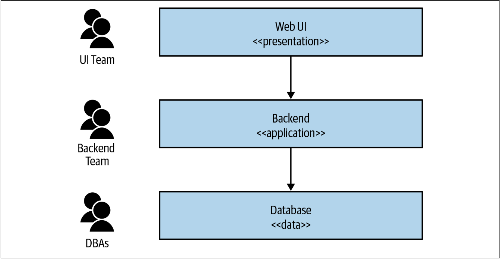
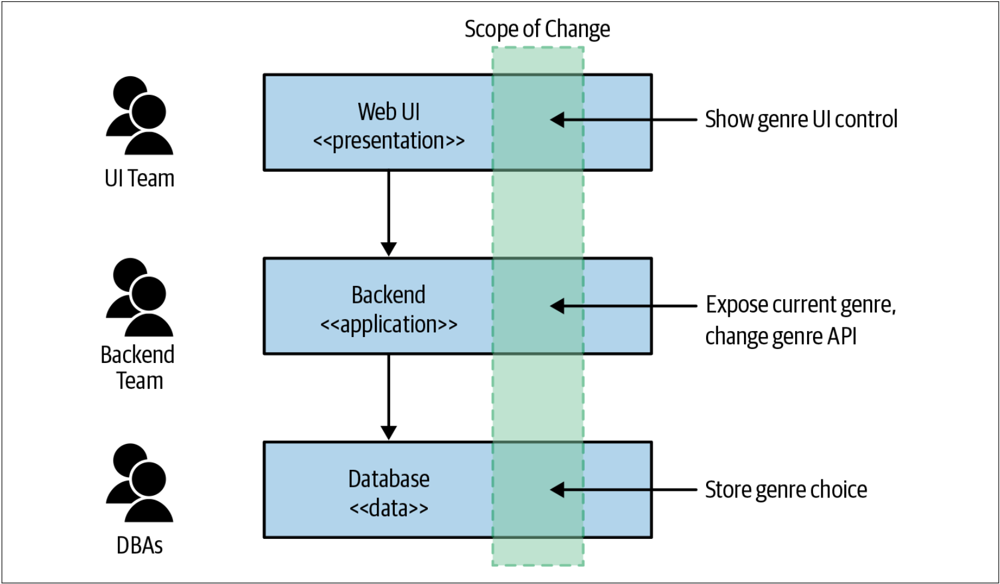
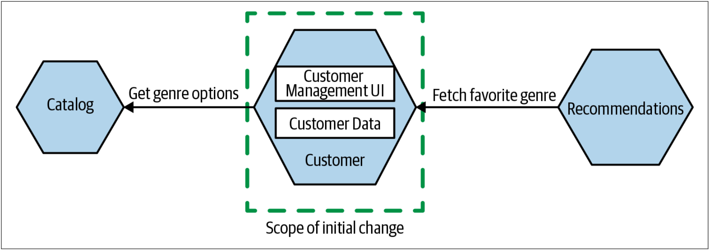
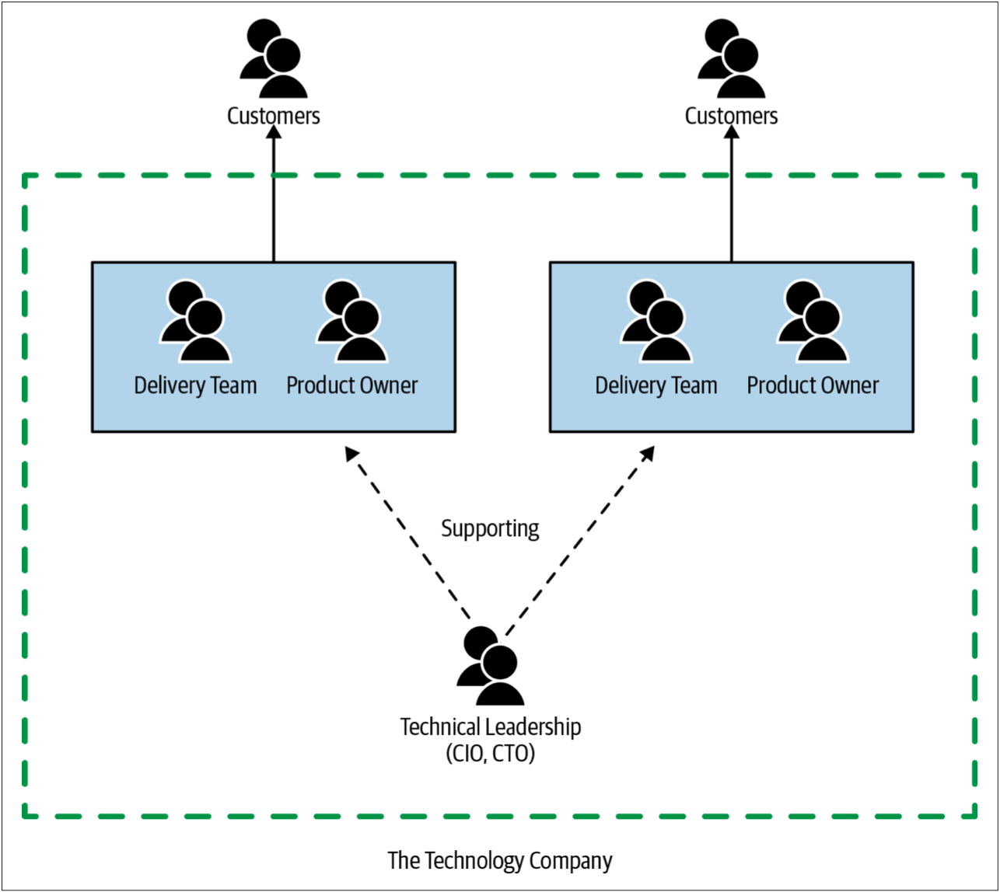

> Well, that escalated quickly, really got out of hand fast! 
> 
——王牌播音员

在深入探讨如何使用微服务之前，对什么是微服务架构达成共识非常重要。我会讨论一些我经常看到的、关于微服务架构的误解，同时也会讨论那些经常被忽略的、微服务的细节之处。需要具备坚实的基础知识，才能充分利用本书其余部分的内容。因此，本章会：
* 解释什么是微服务架构
* 简要回顾微服务是怎样发展起来的（当然，这意味着还要回顾单体架构）
* 探讨微服务架构所带来的优势和挑战


**译者补充：达成共识的重要性**

在讨论某个概念之前，首先对要讨论的事情达成共识，确保我们讨论的是一个事情，这一点非常重要。

参加过很多技术讨论会议，总会发现大家在会上讨论的热火朝天，激情四射，但是到了最后却没达成什么结论。后来，仔细想了下，发现大家会上讨论的某个事情压根就不是一个事情。

一百个人眼中有一百个哈姆雷特，虽然都是在讨论哈姆雷特，但是不幸的是，我们说的不是一个哈姆雷特。

随着接触到的技术概念越来越多，我发现，不同的团队眼中的CI的概念是不同的，敏捷的概念是不同的，CI/CD的概念也是不同的……

现在我终于发现，不同团队所说的微服务的概念也是不同的……

能在一个不同的概念上讨论问题，还能有一些看起来似乎合理的跟进事项，这看起来确实是一件非常神奇的事情。

所以，这里，我极力的推荐大家认真的阅读本书的第一章，这是领会本书精髓的第一步。


# 什么是微服务
微服务是围绕业务领域建模的、可独立部署的服务。微服务利用网络相互通信，作为一种可选的架构，微服务为解决可能遇到的问题提供了许多选择。由此可见，微服务架构基于多个微服务间的协作。

微服务是一种面向服务的架构（*SOA: service-oriented architecture*）。微服务强调如何划分服务边界，并且其关键是服务的独立可部署。同时，微服务还具有与技术无关的优势。

从技术角度来看，微服务通过一个或多个网络端点（*network endpoints*）开放其封装的业务功能。微服务利用这些网络相互通信，从而使其成为一种分布式系统。微服务封装了数据的存储和检索，并通过定义清晰的接口开放其封装的数据。因此，对于微服务而言，数据库会隐藏在服务边界内部。

如上的所有内容都需要展开来细说，因此让我们更深入地研究一下微服务的这些概念。

## 独立部署
独立部署的概念即：无需利用任何其他的服务就可以变更微服务并将其部署到生产环境。更重要的是，独立部署并不仅仅如此。实际上，独立部署是我们在系统中管理部署的方式。大部分的软件发布都应遵循独立部署的准则。独立部署的想法虽然简单，但是执行起来却很复杂。


如果只从本书学到一件事情，那就是：确保自己拥抱微服务**独立部署**的概念。养成独立部署的习惯：无需部署其他任何东西就可以把单个微服务的变更发布到生产环境。一旦养成这个习惯，许多美好的事情将随之而来。


为了保证独立部署，需要确保服务是低耦合的。换句话说，我们能够在无需更改其他任何服务的情况下而变更一个服务。这意味着我们需要在服务之间建立明确的、定义清晰的、稳定的契约。但是，某些具体的实现却导致独立部署变得很困难——例如，共享数据库的方案就特别的麻烦。对具有稳定接口的、低耦合的服务的需求指引着我们思考：如何首先找到服务边界。

## 针对业务领域建模
跨程序边界变更的代价很高。如果发布某个功能需要修改两个服务并编排这两个服务的部署，那么这比在一个服务（或者一个单体应用）内进行相同的变更要做更多的工作。因此，我们接下来想找到方法——以确保尽可能少的跨服务变更。

在无法使用真实的案例来解释某些概念时，本书会沿用我在[Building Microservices](https://www.oreilly.com/library/view/building-microservices/9781491950340/)一书中的方法：使用一个虚拟的领域和公司来解释这些概念。本书讨论的公司是Music Corp。Music Corp是一家大型跨国组织，尽管主要专注于销售CD，但却仍以某种方式维持经营。

我们已经决定让Music Corp在21世纪也能[爆发激情](https://movie.douban.com/subject/1309190/)，并且作为该步骤的一部分，我们正在评估现有的系统架构。在[图1-1](#f11)中，我们看到了一个简单的三层架构（*three-tiered architecture*）。我们有一个基于Web的用户界面，一个业务逻辑层后端（该层为单体应用），以及传统数据库中的数据存储。通常，不同的团队拥有[图1-1](#f11)中的不同的层。

图1-1. Music Crop的传统的3层架构的系统

我们希望简单的修改功能以允许用户可以指定他们喜欢的音乐流派。这要求我们：

* 更改UI，以显示音乐流派选择的UI
* 更改后端服务，为UI显示并修改音乐流派提供数据
* 更改数据库，以保存用户选择的音乐流派

如[图1-2](#f12)所示，这些不同层级的变更将由不同的团队来管理，并且这些变更需要按照正确的顺序来部署。

图1-2. 跨层级修改涉及到更多的工作

目前这种架构还不错。所有架构最终都围绕某些目标进行优化。三层架构之所以如此普遍，部分原因在于它是通用架构——每个人都听说过。因此，选择我们已经在其他地方看到过的通用架构，通常是我们不断看到三层架构的原因之一。但是我认为我们一次又一次的看到这种架构的最大原因是：三层架构基于我们的团队的组织方式。

正如著名的**康威定律**所陈述的那样：
> 设计系统的组织，其产生的设计等同于组织之内、组织之间的沟通结构。
> 
> [
Melvin Conway, How Do Committees Invent?
](https://www.melconway.com/Home/pdf/committees.pdf)

三层架构是康威定律在实践中的一个很好的例子。过去，IT组织主要根据人员的核心能力来分组：数据库管理员与其他数据库管理员组成一个团队，Java开发人员与其他Java开发人员处于一个团队，前端开发人员则处于另外的团队。我们根据人员的核心能力对其分组，因此我们创建了可以与这些团队保持一致的IT资产。

康威定律解释了为什么这种三层架构会如此普遍。三层架构并不算太差，它只是围绕一种软件开发的力量而优化——我们历来按照人们对技术的熟悉程度来分组。但是我们面对的问题已经发生了改变。我们对软件的期望已经发生了变化。现在，我们将人员组织在一个多技术的团队，以减少团队间的交接和团队间的隔阂。我们希望比以往更快地发布软件。这促使我们在组织团队的方式以及如何拆分系统方面做出不同的选择。

改变功能主要是业务功能的变化。但是在[图1-1](#f11)中，业务功能实际上分布在三层架构中的每一层，这增加了跨层修改功能的可能性。对于三层架构而言，我们具有技术上的高内聚，但是业务功能却是低内聚的。如果我们想让功能变更变得更容易，我们需要改变组织代码的方式。在组织代码时，可以选择用业务功能的内聚来替换技术的内聚。最终，每个服务可能包含（也可能不包含）所有的三层，但是，是否包含所有的三层就是服务实现需要关心的问题了。


**译者补充：技术的高内聚和业务的高内聚**

高内聚、低耦合是[Larry Constantine](https://history.computer.org/pioneers/constantine.html)在1974年发表的[**Structured Design**](https://www.academia.edu/7878229/Structured_Design)中提出的概念，目前已经成为判断软件设计好坏的标准之一。

由于历史原因，我们仅从软件工程的领域来考虑内聚和耦合，就像本节讲到的三层架构一样。但是，我们必须意识到，软件是实现业务功能的手段，在实现业务功能的时候，不可避免的会从技术的角度对业务进行拆解，这也导致业务的拆分也会依赖软件的具体实现。

然而，这种方式是合理的吗？是目标依赖执行还是执行要依赖目标？

这让我想起了最近几年一直提倡的**人人都是产品经理**的概念，这实际上就是在要求工程师在实现业务功能的时候，除了考虑技术上的内聚外，还要考虑业务上的内聚，然后综合二者来设计所采用的的架构。然而，不幸的是，大多数团队却在让研发人员为产品提各种idea。

微服务首先是业务逻辑上的高内聚、低耦合，然后才是业务逻辑内的工程实现上的高内聚、低耦合。


让我们将[图1-2](#f12)与[图1-3](#f13)中所示的替代架构进行比较。我们有一个专门的Customer服务，该服务开放了一个UI，以允许用户更新其信息，并且用户的状态也存储在该服务中。最喜欢的音乐类型的选择是与给定的用户相关联的，因此[图1-3](#f13)的功能变更会更加本地化。在[图1-3](#f13)中，我们还显示了从Catalog服务中获取可用类型的列表。我们还看到一个新的Recommendation服务会从Customer服务访问用户所喜欢的音乐流派信息。我们可以在后续的发布版中轻松实现Recommendation服务。

图1-3. 专门的Customer服务可以使记录客户喜欢的音乐类型变得更加容易

在[图1-3](#f13)的情况下，Customer服务将三层架构中的每一层都封装成很轻薄的一层——简单的UI，简单的应用逻辑和简单的数据存储。然而，所有这些层都封装在Customer服务内部。

业务领域已成为推动系统架构发展的主要力量。希望业务领域可以让功能变更更容易，同时让我们更轻松地围绕业务领域组织团队。业务领域非常重要，因此我们会在本章即将结束的时候重新讨论围绕领域建模的概念。我会分享一些关于领域驱动设计的想法，这些想法将影响我们对微服务架构的看法。

## 不要共享数据库
关于微服务，我所能见到的、人们最难应对的事情之一是：微服务不应该共享数据库。如果一个服务要访问另一服务所拥有的数据，则该服务应该通过访问另一个服务以获取所需的数据。这种方式使服务可以确定：共享哪些内容，隐藏哪些内容。服务的内部实现细节可能会出于各种原因而修改。禁止共享数据库还允许服务将其内部的实现细节映射到更稳定的公共契约，从而确保稳定的服务接口。如果需要独立部署的特性，则服务之间必须具备稳定的接口。服务公开的接口不断变化将产生连锁反应，这会导致其他的服务也需要进行变更。


除非必须，否则不要共享数据库。即便如此，也要尽一切可能避免共享数据库。在我看来，如果要实现独立部署，共享数据库是最糟糕的事情之一。


正如我们在[针对业务领域建模](#针对业务领域建模)一节中讨论的那样，我们希望将服务视为业务功能的端到端切片（*end-to-end slices*）：在适当的地方封装UI，应用程序逻辑和数据存储。这是因为我们要减少为修改业务相关功能所付出的精力。以这种方式封装数据和行为，可以使我们的业务功能具备高度的内聚。隐藏服务背后的数据库，还可以确保降低服务耦合。我们稍后会继续讨论耦合和内聚。

很难做到不共享数据库，特别是当我们当前的单体系统拥有一个庞大数据库时。幸运的是，我们会用整个第4章来讨论如何拆分单体数据库。


**译者补充**

共享数据不仅局限于业务单元之间对同一数据库的共享，还存在于交付团队的不同角色之间。例如：研发和测试之间。

2014年的时候，我负责一款App的测试工作。为了提升测试的效率，对于server端的测试而言，采用接口测试的方案来测试。那时候，研发是通过一个本地的lib库来进行MySQL数据的读写，而测试如果要访问数据就必须将研发代码中的lib库迁移到测试代码中，然后根据MySQL的部署情况来修改lib库的配置，从而使不同的人员可以访问自己的数据库。虽然每次运行这些case的时候会提示：确认数据库配置是否正确。但是糟糕的是，这种提示很少有人关注，并且更糟糕的是，case的运行经常因为这种原因而失败。

后来，我提出了一个一切皆接口的方案：在server端提供一个接口来封装本地的lib库。所有的测试case通过封装的数据接口来获取数据库中的数据。事实证明，这种方式实在是一种完美的方案。



## 微服务能够带来什么优势
微服务拥有多种多样的优势。独立部署为改善系统的规模和鲁棒性开辟了新的模型，并允许我们混搭不同的技术。由于微服务之间可以并行工作，因此我们可以投入更多开发人员以解决一个问题。同时，微服务还能保证这些开发人员的工作不会互相干扰。开发人员可以将精力关注在系统的一部分上，因此，开发人员可以更轻松地了解他们所关注的那部分系统。**程序隔离**还可以扩展我们可以选择的技术——混合使用不同的编程语言、编程样式、部署平台或数据库，以便找到合适的组合。

综上所述，微服务架构可以为我们提供灵活性。微服务还为我们将来如何解决问题提供了更多选择。

不过，务必注意，如上的这些优势都不是免费的。可以采用多种方法拆解系统，并且从根本上讲，我们要实现的目标会以不同的方向推动系统拆解。因此，了解我们试图从微服务架构中获得什么非常重要。

## 微服务会产生什么问题
计算机的价格不断降低，因此我们可以拥有更多的计算机，这成为面向服务的架构（*SOA: servic-oriented architecture*）成为现实的部分原因。与其将系统部署在单台大型机上，还不如将系统部署在多台较为便宜的机器。SOA是解决如何才能最好地构建跨多台计算机的应用程序的一种尝试。其中，最主要的挑战之一就是网络问题——计算机之间相互通信的方式。

网络之中的计算机之间的通信并不是即时通信。这意味着我们必须考虑网络通信的延迟（*latency*），尤其是当网络延迟远远超过本地进程内操作的延迟时，我们必须更加关注网络延迟。当网络延迟并不是固定数值时，情况会变得更糟。不固定的网络延迟导致系统行为变得不可预测。同时，我们还必须解决偶尔发生的网络通信失败的现实场景，例如：丢包，网络电缆中断。

网络的挑战使得单进程的单体应用的行为会相对简单。另外，类似事务这样的挑战也会让微服务系统更加难以处理。实际上，是如此的困难，以至于随着系统复杂性的增加，我们可能不得不放弃事务及其带来的安全性，以采用其他的技术（不幸的是，这些技术和事务之间的取舍非常不同）。

处理任何网络调用都可能会失败这样的事实是一件令人头疼的事。同时，我们与之通信的服务可能由于某种原因而无法访问或出现异常的事实同样令人头疼。除此之外，我们还需要开始尝试研究：如何在多台计算机上保证数据的一致性。

当然，如果使用的好，微服务这种新技术可以带来巨大的收益。但是，如果使用不当，新技术就会帮助我们更快的以更有趣、更昂贵的方式犯错。老实说，除了微服务可以带来的好处外，微服务似乎是一个可怕的东西。

值得注意的是，几乎所有的、我们认为是单体应用的系统都是分布式系统。从数据库中读取数据并将数据显示在Web浏览器的单进程应用程序可能会运行在不同的机器。此时，至少有三台通过网络进行通信的计算机。分布式单体系统和微服务架构的区别在于其分布式的程度。当拥有更多计算机，并通过更多网络进行通信时，我们更有可能遇到与分布式系统相关的棘手问题。此处简要讨论的这些问题最初可能不会出现。但是随着时间的流逝，随着系统的发展，即使我们不会遇到所有的问题，也会遇到其中的大多数问题。

正如我的老同事、老朋友、微服务专家James Lewis所说：“Microservices buy you options”。James的话是经过深思熟虑的——they buy you options。微服务是有成本的，因此对于我们的选择而言，我们必须确定该成本是否是值得的。关于微服务成本的话题，我们将在第2章中更详细地探讨。


**译者补充**

曾几何时，我也简单的认为之前采用的分布式的系统就是微服务的架构。直到读了本书，了解到微服务的[独立部署](#独立部署)特性之后，才发现了微服务和之前的分布式单体系统的区别。



## 用户界面的微服务
在拥抱微服务架构时，我经常看到，人们将工作重点完全放在服务器端，从而使得UI还保留在一个单一的单体层中。如果我们想要一种能够更轻松地、更快地部署新功能的架构，那么将UI保留为单体可能是一个很大的错误。我们可以，也应该考虑拆分UI。我们将在第3章中探讨拆解UI的技术。

## 微服务的相关技术
掌握一整套新技术来配合全新的微服务架构实在是太诱人了，但是我奉劝大家不要陷入这种诱惑之中。采用任何新技术都会有成本，新技术还将带来一些动荡。但愿，这些成本还是值得的（当然，如果选择了正确的技术）。但是初次采用微服务架构时，我们掌握的技术已经足够了。

微服务架构的正确发展和管理涉及到解决与分布式系统相关的众多挑战，这些挑战可能是我们以前从未遇到过的挑战。我认为，在遇到这些问题时，如下的做法会更加有用：

1. 利用我们熟悉的技术栈及时解决这些问题
2. 然后考虑改变现有的技术是否可以帮助解决我们发现的问题

正如我们已经谈到的那样，究其根本而言，微服务与技术无关。只要服务可以通过网络相互通信，其他所有的技术都可以缓缓图之。微服务具有巨大的优势——他允许我们可以根据需要来混搭技术堆栈。

不必使用Kubernetes，Docker，容器或公有云。更无需使用Go，Rust或其他任何新的编程语言来编码。实际上，就微服务架构而言，我们所选择的编程语言并不重要。对于微服务架构而言，不同编程语言的差异仅在于某些语言可能具有更丰富的生态系统——支持库和框架。如果最了解PHP，就用PHP开始构建服务！[^1]莫让方案的选择成为问题的一部分！选择最适合我们的方案，并在遇到问题时做出变更以解决问题。

## 微服务的规模
我最经常遇到的问题是：一个微服务的规模应该控制在多大范围？因为从术语“微服务（*micro-services*）”来看，“micro”就包含在名称中，因此讨论微服务的规模也就不足为奇。但是，一旦了解了是什么使得微服务可以作为一种架构而工作，微服务规模的概念实际上就会成为最不应该关心的问题之一。

如何来度量微服务的规模呢？使用代码行数？代码行数的度量方式有时并没有意义。25行的Java代码实现的功能对于Clojure而言，可能仅需要10行就可以实现。但是，这并不意味着Clojure好于/差于Java，只能说明相比于其他语言，有些语言更富于表达性。

我能想到的、“规模”一词对微服务而言有任何意义的、最接近的描述是微服务专家Chris Richardson曾经说过的——微服务的目标是“具有尽可能小的接口”。此时规模的含义更接近信息隐藏的概念（我们稍后将会讨论），但也确实代表了在事实之后寻找意义的尝试——当我们第一次谈论这些东西时，我们的主要关注点，至少是最初的关注点，是这些服务真的很容易替换。

最终，“规模”的概念与上下文高度相关。对于在某个系统上工作了15年的人而言，他们会觉得他们的100K行代码的系统非常容易理解。然而，对于该项目的新手而言，他们会觉得100K行代码的系统太大了。同样的，如果询问一家刚刚开始微服务转型的公司（该公司可能拥有少于十个微服务），与多年以来一直采用微服务的相同规模的公司相比（该公司现在已经拥有数百个服务），我们可能会得到不同的答案。

我奉劝人们不要担心规模。刚开始时，专注于两个关键问题尤为重要：

* 首先，我们可以处理多少个微服务？随着我们拥有的服务不断增加，系统的复杂性将随之增加。同时我们还必须学习新技能（也许采用新技术）来应对系统不断增加的复杂性。因此，我坚决主张逐步迁移到微服务架构。
* 其次，如何定义微服务边界以充分利用业务的拆解，而又不会因为业务拆解让所有事情变得一团糟？

我们会在本章的其余部分介绍如上的主题。

> **
“微服务”一词的历史
**
> 早在2011年，当我还在ThoughtWorks咨询公司工作时，我的朋友、当时的同事[**James Lewis**](https://twitter.com/boicy)就对他所谓的“micro-apps”非常感兴趣。他发现有些使用SOA的公司已经开始使用这种模式，并且这些公司正在优化这种“micro-app”架构以使服务易于替换。上述被提及的公司都对快速部署特定功能感兴趣，但是他们认为，如果需要扩展所有功能，可以用其他技术栈将其重写。
> 
> 当时突出的是这些服务的范围有多小。在几天内就可能实现（或重写）其中的某些服务。James继续说：“services should be no bigger than my head.”，其思想就是：功能范围应该易于理解，因此才会易于改变。
> 
> 后来，在2012年，James在一次架构峰会上分享了这些想法。我们当中有些人也出席了那次架构峰会。在那次会议上，我们讨论了以下事实：实际上这些所谓的“micro-apps”并不是独立的应用程序，因此“micro-apps”的说法并不完全正确。相反，“microservices”这种称呼似乎更合适。[^2]

## 微服务的主人翁意识
利用围绕业务领域建模的微服务，我们可以看到：IT产物（可独立部署的微服务）与业务领域之间是一致的。当我们考虑转变技术公司从而打破“业务”和“ IT”之间的鸿沟时，微服务这一思想会引发我们的共鸣。如[图1-4](#f14)，在传统的IT组织中，软件开发的行为通常和业务部门（业务部门是连接客户，并定义需求的部门）完全分离。这类组织的功能失调是多种多样的，因此此处无需再展开讨论。

图1-4. 传统的IT/Business的划分

相反，如[图1-5](#f15)所示，我们看到真正的技术组织和先前的、分散的组织孤岛完全整合在一起。现在，产品负责人直接作为交付团队的一部分而工作，这些团队围绕面向客户的产品线而对齐，而不再是随心所欲的技术分组。对于[图1-5](#f15)而言，集中式IT部门已不是常态，任何的集中式IT部门的存在都是为了支持以客户为中心的交付团队而存在。

图1-5. 技术公司如何集成软件交付的例子

虽然并非所有组织都做出了这一转变，但微服务架构使转变更加容易。如果希望交付团队围绕产品系列进行调整，服务围绕业务领域进行调整，那么将所有权明确分配给这些面向产品的交付团队会变得更加容易。减少跨团队共享服务是最小化交付冲突的关键——面向业务领域的微服务架构让组织结构的转变变得更加容易。

---
[^1]: For more on this topic, I recommend PHP Web Services by Lorna Jane Mitchell (O’Reilly). There is far too much technical snobbery out there toward some technology stacks that can unfortunately border on contempt for people who work with particular tools. After reading Aurynn Shaw’s [“Contempt Culture” blog post](https://blog.aurynn.com/2015/12/16-contempt-culture), I recognized that in the past I have been guilty of showing some degree of contempt toward differ‐ ent technologies, and by extension the communities around them.
[^2]: I can’t recall the first time we actually wrote down the term, but I vividly recall my insistence, in the face of all logic around grammar, that the term should not be hyphenated. In hindsight, it was a hard-to-justify position, which I nonetheless stuck to. I stand by my unreasonable, but ultimately victorious choice.

